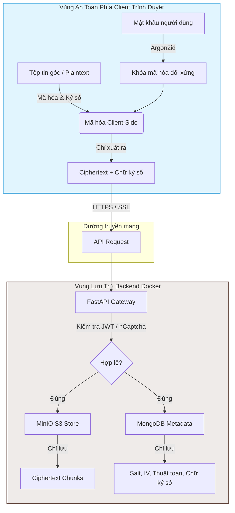
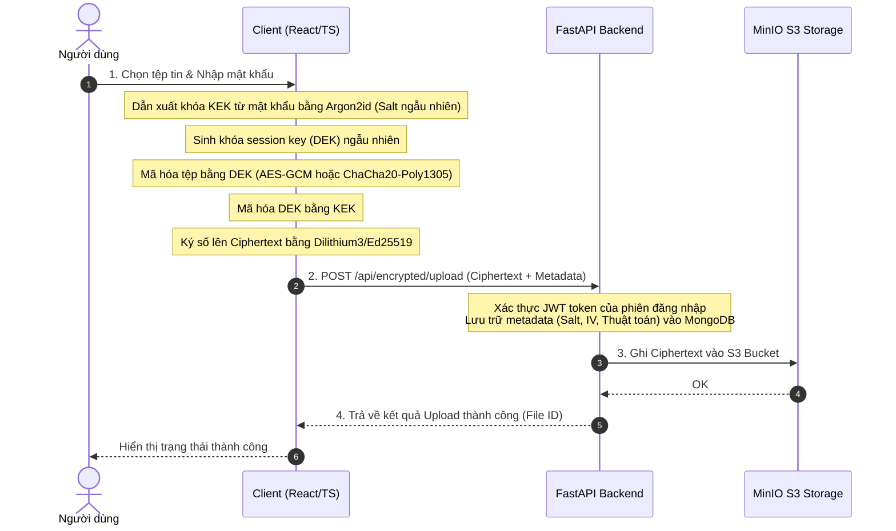
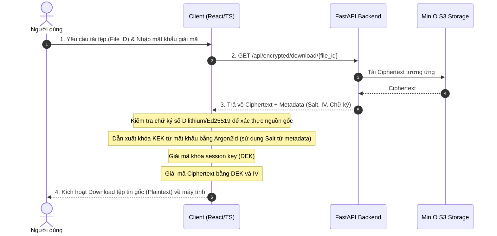

# 🔐 Zero-Knowledge File Encryption System

> **Hệ thống mã hóa tệp tin Zero-Knowledge kháng lượng tử (Post-Quantum)**. Toàn bộ quá trình mã hóa, giải mã và ký số được thực hiện 100% tại client (trình duyệt). Server chỉ đóng vai trò là một kho chứa "mù" (blind storage) lưu trữ dữ liệu đã mã hóa và siêu dữ liệu (metadata) không nhạy cảm.

English version: 🇺🇸 [English](./README.md)

[](docker-compose.yml)
[](backend/)
[](frontend/)
[](LICENSE)

---

## 1. Dự án này giải quyết vấn đề gì?

Khi lưu trữ tệp tin trên các dịch vụ đám mây truyền thống (như Google Drive, Dropbox hoặc AWS S3 thông thường):
1. **Mất quyền kiểm soát khóa (Key Control):** Dữ liệu được mã hóa ở server-side (SSE), nghĩa là nhà cung cấp đám mây nắm giữ khóa giải mã. Nếu cơ sở hạ tầng của họ bị tấn công hoặc bị yêu cầu bàn giao pháp lý, dữ liệu của bạn sẽ bị lộ.
2. **Mối đe dọa từ máy tính lượng tử (Quantum Threat):** Các thuật toán mã hóa bất đối xứng hiện tại (như RSA, ECC, Diffie-Hellman) dùng để trao đổi khóa và ký số có thể bị bẻ gãy hoàn toàn trong tương lai gần bởi thuật toán Shor trên máy tính lượng tử.

### Giải pháp của chúng tôi:
* **Zero-Knowledge Architecture:** Khóa mã hóa được dẫn xuất trực tiếp từ mật khẩu của người dùng thông qua thuật toán băm bộ nhớ cao **Argon2id** ngay tại trình duyệt. Khóa này chỉ tồn tại tạm thời trong RAM của thiết bị client và **không bao giờ** được gửi lên mạng hoặc lưu trữ ở backend.
* **Post-Quantum Cryptography (PQC):** Tích hợp thuật toán trao đổi khóa lai kháng lượng tử (**Kyber1024** + X25519) và chữ ký số kháng lượng tử (**Dilithium3/5** + Ed25519) để bảo vệ tệp tin an sau này trước các cuộc tấn công giải mã trong tương lai ("Harvest Now, Decrypt Later").

---

## 2. Cách hệ thống hoạt động (System Architecture)

Sơ đồ dưới đây thể hiện sự phân tách hoàn toàn giữa vùng dữ liệu nhạy cảm (phía Client) và vùng lưu trữ (phía Server):



---

## 3. Luồng xử lý chính (Core Processing Flows)

### Luồng Mã hóa & Upload Tệp
Quá trình chuẩn bị dữ liệu mã hóa xảy ra hoàn toàn trong bộ nhớ RAM của trình duyệt trước khi thực hiện bất kỳ kết nối mạng nào:



### Luồng Tải xuống & Giải mã Tệp
Để đọc lại tệp tin, client tải xuống bản mã và giải mã cục bộ:



---

## 4. Các tính năng nổi bật

* **Mã hóa tệp tin dung lượng lớn (Chunked Streaming):** Đối với các tệp lớn (>50MB), client tự động chia nhỏ thành các chunk từ 1MB–10MB, thực hiện mã hóa và truyền phát (streaming) liên tục để tránh tràn bộ nhớ RAM của trình duyệt.
* **Mã hóa thư mục giữ nguyên cấu trúc:** Tự động nén cấu trúc thư mục thành định dạng ZIP ở phía client, thực hiện mã hóa file ZIP đó và tự động giải nén khôi phục lại cây thư mục ban đầu khi giải mã thành công.
* **Xác thực đa yếu tố (2FA) & Chống Brute Force:** Tích hợp mã OTP qua Email bảo vệ tài khoản, hỗ trợ khóa tài khoản tạm thời sau 5 lần đăng nhập sai, và bắt buộc xác thực **hCaptcha** đối với các hành vi đáng ngờ.
* **Chế độ Xuất/Nhập ngoại tuyến (Offline Packages):** Cho phép người dùng tải trực tiếp gói tệp đã mã hóa kèm siêu dữ liệu (định dạng `.encrypted`) về máy để lưu trữ ngoại tuyến hoặc gửi qua các kênh khác, sau đó tự giải mã offline bằng công cụ cục bộ mà không cần kết nối tới server.

---

## 5. Kiến trúc & Tech Stack

Dự án được xây dựng dựa trên kiến trúc hướng dịch vụ (Service-Oriented Architecture), đóng gói hoàn toàn bằng Docker Containers:

* **Frontend:** React 18 (TypeScript), Vite (Build tool cực nhanh), Material-UI (Giao diện bảng điều khiển chuyên nghiệp), Tailwind CSS (Layout responsive).
* **Mật mã học phía Client (Crypto Core):**
  * `Web Crypto API` cho mã hóa đối xứng AES-GCM hiệu năng cao.
  * `@noble/ciphers` và `@noble/post-quantum` cho các thuật toán kháng lượng tử (Kyber1024, Dilithium).
  * `libsodium-wrappers` cung cấp các hàm mật mã học tiêu chuẩn công nghiệp (ChaCha20-Poly1305, Ed25519).
  * `argon2-browser` biên dịch WebAssembly (Wasm) tối ưu tốc độ băm Argon2id trực tiếp trong trình duyệt.
* **Backend:** FastAPI (Python 3.11) bất đồng bộ (async/await), Pydantic v2 quản lý cấu hình dữ liệu nghiêm ngặt.
* **Cơ sở dữ liệu & Lưu trữ:**
  * **MongoDB 6.0:** Lưu trữ dữ liệu tài khoản người dùng, cấu hình bảo mật và metadata của tệp.
  * **MinIO:** Máy chủ lưu trữ đối tượng tương thích chuẩn AWS S3 API hiệu năng cao.

---

## 6. Cài đặt và chạy dự án (Quick Start)

Yêu cầu duy nhất để chạy toàn bộ hệ thống là máy tính của bạn đã cài đặt **Docker** và **Docker Compose**.

### Bước 1: Sao chép dự án
```bash
git clone https://github.com/<your-username>/zero-knowledge-pqc-file-encryption.git
cd zero-knowledge-pqc-file-encryption
```

### Bước 2: Tạo file cấu hình môi trường
Sao chép cấu hình mẫu:
```bash
cp .env.example .env
```
Mở file `.env` bằng bất kỳ trình soạn thảo nào và cập nhật các giá trị bảo mật bắt buộc:
* `SECRET_KEY`: Khóa bí mật dùng để ký JWT. Tạo khóa ngẫu nhiên bằng lệnh:
  ```bash
  python -c "import secrets; print(secrets.token_hex(32))"
  ```
* `MONGO_ROOT_PASSWORD`: Mật khẩu quản trị cho cơ sở dữ liệu MongoDB.
* `MINIO_ACCESS_KEY` & `MINIO_SECRET_KEY`: Tài khoản đăng nhập vào MinIO console và API storage.
* `SMTP_USERNAME` & `SMTP_PASSWORD`: Tài khoản Email gửi mã OTP xác thực (Ví dụ: Gmail App Password).

### Bước 3: Khởi động hệ thống với Docker Compose
Chạy lệnh duy nhất để build và kích hoạt tất cả các dịch vụ:
```bash
docker compose up -d --build
```

### Bước 4: Truy cập ứng dụng
Sau khi các container báo trạng thái `healthy` (khoảng 1–2 phút ở lần chạy đầu tiên):

* **Giao diện người dùng (Frontend):** [http://localhost:3000](http://localhost:3000)
* **Tài liệu Swagger API (Backend):** [http://localhost:8000/docs](http://localhost:8000/docs)
* **Giao diện quản lý lưu trữ (MinIO Console):** [http://localhost:9001](http://localhost:9001)

### Quản lý container:
* Xem trạng thái các dịch vụ: `docker compose ps`
* Xem logs hệ thống: `docker compose logs -f`
* Dừng hệ thống (giữ nguyên dữ liệu lưu trữ): `docker compose down`
* Reset hoàn toàn hệ thống (xóa sạch dữ liệu): `docker compose down -v`

---

## 7. Cấu trúc mã nguồn & Vai trò thành phần

```
.
├── backend/                   # 🐍 FastAPI Backend Application
│   ├── main.py                # Điểm khởi đầu ứng dụng, đăng ký CORS & Routers
│   ├── requirements.txt       # Danh sách thư viện Python phụ thuộc
│   ├── Dockerfile             # Multi-stage build cho Python 3.11-slim
│   ├── app/
│   │   ├── api/               # Router xử lý HTTP Requests
│   │   │   ├── auth.py        # Đăng ký, đăng nhập, OTP và khôi phục mật khẩu
│   │   │   ├── encrypted_file.py # API upload, download, quản lý tệp tin
│   │   │   ├── security.py    # Log bảo mật và kiểm tra thiết bị
│   │   │   └── analytics.py   # Phân tích lưu lượng mã hóa của người dùng
│   │   ├── core/              # Các cấu hình hệ thống cốt lõi
│   │   │   ├── config.py      # Đọc và validate biến môi trường qua Pydantic
│   │   │   ├── security.py    # Logic tạo/xác thực JWT và băm mật khẩu
│   │   │   └── minio_client.py# Client kết nối và kiểm tra sức khỏe MinIO S3
│   │   ├── services/          # Tầng nghiệp vụ (Business Logic Services)
│   │   │   ├── encrypted_file_service.py # Xử lý phân luồng tệp tin mã hóa
│   │   │   ├── email_service.py # Soạn và gửi email thông báo hệ thống
│   │   │   └── otp_service.py # Tạo, lưu trữ tạm thời và xác thực mã OTP
│   │   └── database.py        # Thiết lập kết nối cơ sở dữ liệu MongoDB
│   └── scripts/
│       └── setup_minio.py     # Tự động tạo S3 Bucket nếu chưa tồn tại
│
├── frontend/                  # ⚛️ React + TypeScript Frontend Application
│   ├── src/
│   │   ├── main.tsx           # Điểm khởi tạo ứng dụng React
│   │   ├── App.tsx            # Định tuyến (Routing) và cấu hình theme
│   │   ├── crypto/            # ⭐ Trọng tâm mật mã học phía Client
│   │   │   ├── zero_knowledge.ts     # Khởi tạo AES-GCM, dẫn xuất khóa Argon2id
│   │   │   ├── chunked_encryption.ts # Chia nhỏ tệp lớn và xử lý luồng stream
│   │   │   └── advanced_features.ts  # Thực hiện Kyber1024 và ký số Dilithium
│   │   ├── pages/             # Các màn hình chức năng chính của giao diện
│   │   ├── components/        # Các UI Components tái sử dụng
│   │   ├── services/          # Các hàm gọi API (Axios wrapper)
│   │   └── config/env.ts      # Quản lý tập trung các biến môi trường frontend
│   ├── Dockerfile             # Build Vite app và deploy trên Nginx Server tối ưu
│   └── nginx.conf             # Cấu hình Nginx reverse proxy và bảo mật headers
│
├── docs/                      # 📚 Tài liệu kỹ thuật chi tiết
│   ├── API_DOCUMENTATION.md   # Chi tiết các API endpoints
│   ├── SECURITY_GUIDE.md      # Mô hình đe dọa (Threat Model) & thiết kế mật mã
│   └── SYSTEM-OVERVIEW.md     # Bản vẽ kiến trúc tổng quát của hệ thống
│
├── scripts/
│   ├── deploy.sh              # Kịch bản tự động hóa kiểm tra và deploy hệ thống
│   └── mongo-init.js          # Thiết lập cấu trúc cơ sở dữ liệu MongoDB và Index
│
├── docker-compose.yml         # File cấu hình Docker Compose chính
└── .gitignore                 # Bỏ qua các file nhạy cảm khi push lên Git
```

---

## 8. Hướng dẫn phát triển và kiểm thử (Development & Testing)

Để chạy các bài kiểm thử chất lượng mã nguồn:

### Kiểm thử Frontend (Kiểm tra thuật toán mã hóa trực tiếp trên JS):
Các bài test nằm trong thư mục `frontend/src/__tests__` mô phỏng các thuật toán mã hóa đối xứng, bất đối xứng kháng lượng tử, kiểm tra tính toàn vẹn của tệp tin:
```bash
cd frontend
npm install
npm run test:run  # Chạy kiểm thử mật mã học một lần
```

### Kiểm thử Backend (FastAPI API endpoints):
```bash
cd backend
python -m venv .venv
source .venv/bin/activate  # Windows: .venv\Scripts\activate
pip install -r requirements.txt
pytest -v                  # Chạy toàn bộ test suites của backend
```

---

## 🛡️ Tuyên bố miễn trừ trách nhiệm (Security Disclaimer)
*Dự án này được xây dựng như một công trình nghiên cứu khoa học học thuật (Đồ án tốt nghiệp / Đồ án niên luận). Mặc dù các nguyên tắc mật mã học được triển khai chính xác theo lý thuyết, bạn nên thực hiện các cuộc kiểm thử bảo mật chuyên sâu (penetration testing) và đánh giá lỗ hổng mã nguồn trước khi áp dụng hệ thống này vào môi trường sản xuất thực tế lưu trữ dữ liệu nhạy cảm của doanh nghiệp.*
