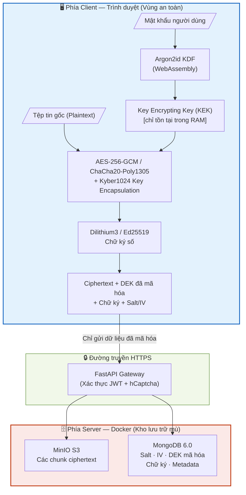
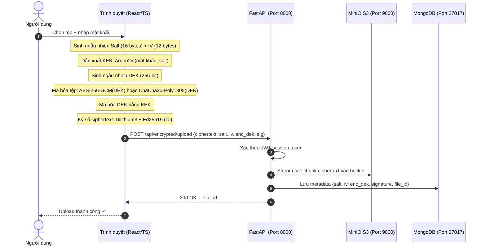
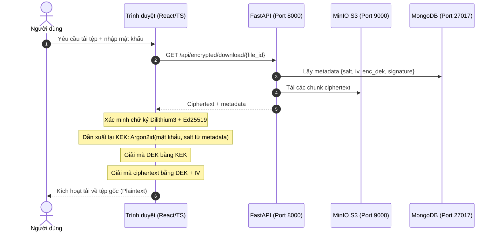

# 🔐 Zero-Knowledge File Encryption System

> Hệ thống lưu trữ tệp tin mã hóa đầu cuối (end-to-end) tích hợp **mật mã học kháng lượng tử**. Toàn bộ quá trình mã hóa, giải mã và ký số được thực hiện **100% trên trình duyệt** — server không bao giờ nhìn thấy dữ liệu gốc hay khóa bí mật.

🇺🇸 [English](./README.md)

[](docker-compose.yml)
[](backend/)
[](frontend/)
[](backend/)
[](LICENSE)

---

## Mục lục
1. [Bối cảnh và vấn đề](#1-bối-cảnh-và-vấn-đề)
2. [Kiến trúc hệ thống](#2-kiến-trúc-hệ-thống)
3. [Luồng mã hóa và giải mã](#3-luồng-mã-hóa-và-giải-mã)
4. [Tính năng nổi bật](#4-tính-năng-nổi-bật)
5. [Công nghệ sử dụng](#5-công-nghệ-sử-dụng)
6. [Cài đặt và chạy thử](#6-cài-đặt-và-chạy-thử)
7. [Cấu trúc mã nguồn](#7-cấu-trúc-mã-nguồn)
8. [Kiểm thử](#8-kiểm-thử)

---

## 1. Bối cảnh và vấn đề

**Vấn đề:** Các dịch vụ lưu trữ đám mây phổ biến (Google Drive, Dropbox, AWS S3) mã hóa tệp tin bằng *khóa của chính họ*. Nếu hệ thống của họ bị tấn công hoặc bị cơ quan pháp lý yêu cầu, dữ liệu của người dùng sẽ bị lộ. Nghiêm trọng hơn, toàn bộ hệ thống mã hóa khóa công khai hiện tại (RSA, ECC, Diffie-Hellman) có thể bị bẻ gãy hoàn toàn bởi máy tính lượng tử thông qua thuật toán Shor. Kẻ tấn công hoàn toàn có thể thu thập dữ liệu mã hóa ngay hôm nay và đợi đến khi có máy tính lượng tử để giải mã (*"Harvest Now, Decrypt Later"*).

**Giải pháp theo hai nguyên tắc:**

| Nguyên tắc | Ý nghĩa thực tế |
|---|---|
| **Zero-Knowledge** | Khóa mã hóa được dẫn xuất từ mật khẩu người dùng (Argon2id, chạy trực tiếp trên trình duyệt). Khóa không bao giờ rời khỏi thiết bị. |
| **Kháng lượng tử (PQC)** | Trao đổi khóa: **Kyber1024 + X25519** (lai). Chữ ký số: **Dilithium3 + Ed25519** (lai). Cả hai đều là chuẩn NIST PQC. |

---

## 2. Kiến trúc hệ thống

Kiến trúc được thiết kế với ranh giới bắt buộc: **mọi thao tác nhạy cảm xảy ra trong trình duyệt, không bao giờ trên server**.



**Server lưu gì và không thể truy cập gì:**

| Được lưu trên Server | Không bao giờ có trên Server |
|---|---|
| Ciphertext (binary đã mã hóa) | Tệp tin gốc (Plaintext) |
| Salt, IV, loại thuật toán | Khóa giải mã |
| DEK đã mã hóa | Mật khẩu người dùng |
| Chữ ký số | KEK dẫn xuất từ Argon2id |

---

## 3. Luồng mã hóa và giải mã

### Upload — Mã hóa & Lưu trữ



### Download — Tải xuống & Giải mã



---

## 4. Tính năng nổi bật

### Hỗ trợ tệp dung lượng lớn (Chunked Streaming)
Tệp tin có dung lượng trên **50 MB** được tự động chia nhỏ thành các chunk **1 MB – 10 MB**. Mỗi chunk được mã hóa độc lập và truyền phát liên tục, tránh tràn bộ nhớ RAM của trình duyệt.

### Mã hóa thư mục
Kéo thả cả một thư mục vào ứng dụng. Trình duyệt tự nén thành file ZIP, mã hóa toàn bộ archive, và phục hồi lại cây thư mục khi giải mã thành công.

### Xác thực đa yếu tố (2FA)
- Mã OTP gửi qua Email tại mỗi lần đăng nhập
- Khóa tài khoản tạm thời sau **5 lần đăng nhập sai liên tiếp**
- Bắt buộc xác thực **hCaptcha** khi phát hiện hành vi đáng ngờ

### Gói lưu trữ ngoại tuyến (Offline Packages)
Xuất tệp đã mã hóa dưới dạng gói `.encrypted` (ciphertext + metadata). Gói này có thể được giải mã cục bộ mà không cần kết nối đến server.

---

## 5. Công nghệ sử dụng

### Các dịch vụ (Docker Compose)

| Dịch vụ | Công nghệ | Port |
|---|---|---|
| Frontend | React 18 + TypeScript + Vite → Nginx | `3000` |
| Backend API | FastAPI 0.116.1 + Python 3.11 (async) | `8000` |
| Object Storage | MinIO (tương thích S3) | `9000` API · `9001` UI |
| Database | MongoDB 6.0 | `27017` |

### Mật mã học phía Client (chạy trong trình duyệt)

| Thư viện | Vai trò |
|---|---|
| `Web Crypto API` (native) | Mã hóa đối xứng AES-256-GCM (tăng tốc phần cứng) |
| `argon2-browser` (WASM) | Dẫn xuất khóa Argon2id từ mật khẩu |
| `@noble/post-quantum` | Kyber1024 (KEM) + Dilithium3 (chữ ký số) — chuẩn NIST PQC |
| `libsodium-wrappers` | X25519 (ECDH) + Ed25519 (chữ ký) + ChaCha20-Poly1305 |
| `@noble/ciphers` | Các cài đặt bổ sung cho mật mã đối xứng |

### Thư viện Backend

| Thư viện | Vai trò |
|---|---|
| `liboqs-python 0.14.0` | Open Quantum Safe — thao tác PQC phía server |
| `argon2-cffi 25.1.0` | Băm mật khẩu tài khoản người dùng |
| `pydantic v2` | Kiểm tra dữ liệu và cấu hình môi trường |
| `python-jose` | Tạo và xác thực JWT token |
| `minio 7.2.0` | MinIO S3 SDK |
| `pyotp` | Tạo mã OTP (TOTP/HOTP) |
| `aiosmtplib` | Gửi email bất đồng bộ (OTP) |

---

## 6. Cài đặt và chạy thử

**Yêu cầu duy nhất:** Máy tính đã cài đặt Docker và Docker Compose.

### Bước 1 — Clone dự án

```bash
git clone https://github.com/<your-username>/zero-knowledge-pqc-file-encryption.git
cd zero-knowledge-pqc-file-encryption
```

### Bước 2 — Cấu hình môi trường

```bash
cp .env.example .env
```

Mở `.env` và cập nhật các biến sau:

| Biến | Mô tả |
|---|---|
| `SECRET_KEY` | Khóa ký JWT — tạo bằng `python -c "import secrets; print(secrets.token_hex(32))"` |
| `MONGO_ROOT_PASSWORD` | Mật khẩu quản trị MongoDB |
| `MINIO_ACCESS_KEY` / `MINIO_SECRET_KEY` | Tài khoản MinIO |
| `SMTP_USERNAME` / `SMTP_PASSWORD` | Tài khoản email gửi OTP (ví dụ: Gmail App Password) |

### Bước 3 — Khởi động

```bash
docker compose up -d --build
```

Các container khởi động trong khoảng **1–2 phút** (lần đầu cần pull image và build). Theo dõi trạng thái:

```bash
docker compose ps          # kiểm tra trạng thái health
docker compose logs -f     # xem log toàn bộ dịch vụ
```

### Bước 4 — Truy cập

| Dịch vụ | Địa chỉ |
|---|---|
| Giao diện Web | http://localhost:3000 |
| API Docs (Swagger) | http://localhost:8000/docs |
| MinIO Console | http://localhost:9001 |

### Dừng hệ thống

```bash
docker compose down          # dừng, giữ nguyên dữ liệu
docker compose down -v       # dừng + xóa toàn bộ volumes (reset hoàn toàn)
```

---

## 7. Cấu trúc mã nguồn

```
.
├── backend/                        # Ứng dụng FastAPI (Python 3.11)
│   ├── main.py                     # Cấu hình CORS + đăng ký router
│   ├── requirements.txt            # Thư viện Python (50 packages)
│   ├── Dockerfile                  # Multi-stage build, python:3.11-slim
│   └── app/
│       ├── api/                    # HTTP route handlers (9 module)
│       │   ├── auth.py             # Đăng ký · đăng nhập · OTP · đặt lại mật khẩu
│       │   ├── encrypted_file.py   # Upload · download · xóa · danh sách tệp
│       │   ├── crypto.py           # Thao tác PQC phía server
│       │   ├── security.py         # Nhật ký bảo mật · nhận diện thiết bị
│       │   ├── analytics.py        # Phân tích mức sử dụng mã hóa theo người dùng
│       │   ├── dashboard.py        # Số liệu admin dashboard
│       │   ├── activity.py         # Lịch sử hoạt động
│       │   └── user.py             # Quản lý hồ sơ người dùng
│       ├── core/
│       │   ├── config.py           # Pydantic settings (xác thực biến môi trường)
│       │   ├── security.py         # Tạo JWT · băm mật khẩu Argon2id
│       │   └── minio_client.py     # MinIO S3 client + kiểm tra sức khỏe
│       ├── services/               # Tầng nghiệp vụ (Business Logic)
│       │   ├── encrypted_file_service.py  # Xử lý luồng tệp mã hóa (chunked)
│       │   ├── email_service.py    # Soạn và gửi email OTP
│       │   └── otp_service.py      # Tạo · lưu tạm · xác thực mã OTP
│       └── database.py             # Kết nối MongoDB bất đồng bộ
│
├── frontend/                       # React 18 + TypeScript (Vite)
│   ├── src/
│   │   ├── crypto/                 # ⭐ Lõi mật mã học phía Client
│   │   │   ├── zero_knowledge.ts   # AES-256-GCM · dẫn xuất khóa Argon2id
│   │   │   ├── advanced_features.ts # Kyber1024 · Dilithium3 · Ed25519
│   │   │   └── chunked_encryption.ts # Chia nhỏ tệp + streaming
│   │   ├── pages/                  # Màn hình chức năng (15 trang)
│   │   ├── components/             # UI Components tái sử dụng (30 components)
│   │   ├── services/               # Axios API wrappers (6 module)
│   │   └── __tests__/              # Unit test mật mã học
│   ├── Dockerfile                  # Build Vite → Nginx production image
│   └── nginx.conf                  # Reverse proxy + security headers
│
├── docs/
│   ├── API_DOCUMENTATION.md        # Tham chiếu đầy đủ các API endpoint
│   ├── SECURITY_GUIDE.md           # Mô hình đe dọa + thiết kế mật mã học
│   └── SYSTEM-OVERVIEW.md          # Tổng quan kiến trúc hệ thống
│
├── scripts/
│   ├── deploy.sh                   # Script tự động hóa triển khai
│   └── mongo-init.js               # Khởi tạo index MongoDB
│
├── docker-compose.yml              # Điều phối 4 dịch vụ Docker
└── .env.example                    # Template biến môi trường
```

---

## 8. Kiểm thử

### Frontend — Kiểm thử thuật toán mã hóa

Các bài test nằm trong `frontend/src/__tests__/`, kiểm tra tính đúng đắn của thuật toán và tính toàn vẹn dữ liệu mà không cần kết nối mạng:

```bash
cd frontend
npm install
npm run test:run
```

### Backend — Kiểm thử API tích hợp

```bash
cd backend
python -m venv .venv
# Linux/macOS:
source .venv/bin/activate
# Windows:
.venv\Scripts\activate

pip install -r requirements.txt
pytest -v
```

---

## 🛡️ Tuyên bố miễn trừ trách nhiệm

Đây là **dự án nghiên cứu học thuật** (đồ án tốt nghiệp / niên luận). Thiết kế mật mã học tuân theo các chuẩn đã được thiết lập (NIST FIPS 203/204, RFC 9106 cho Argon2). **Không triển khai hệ thống này trong môi trường sản xuất lưu trữ dữ liệu nhạy cảm khi chưa thực hiện kiểm thử bảo mật chuyên sâu (penetration test) và đánh giá mã nguồn bởi chuyên gia độc lập.**
