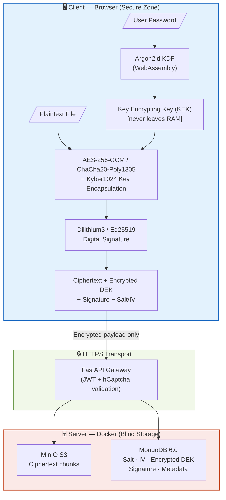
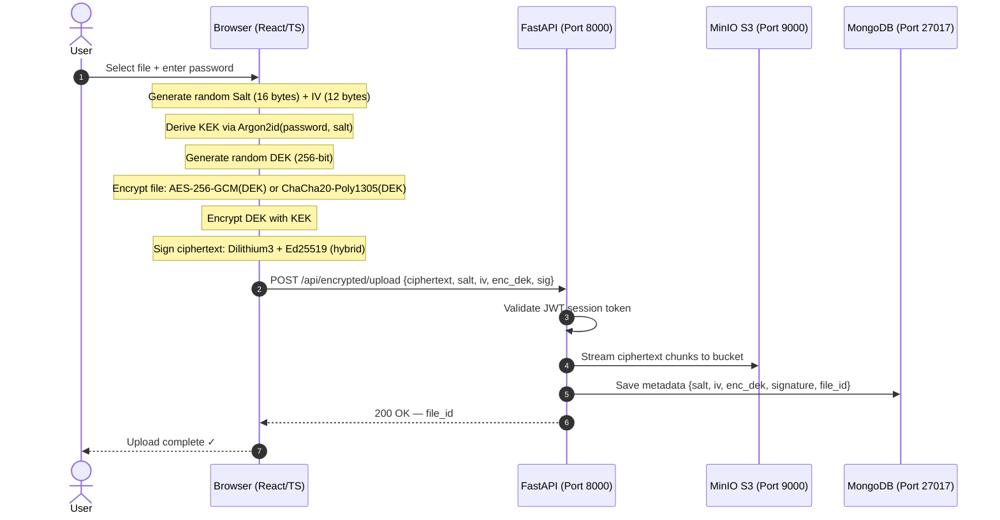
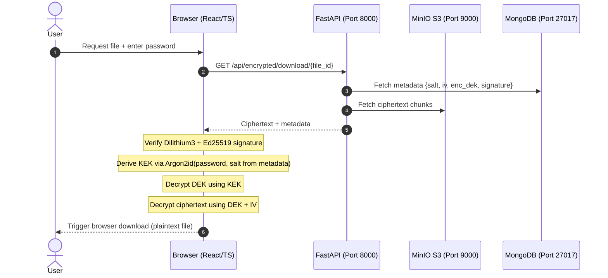

# 🔐 Zero-Knowledge File Encryption System

> End-to-end encrypted file storage with **post-quantum cryptography**. Encryption, decryption, and digital signing are performed **100% in the browser** — the server never sees plaintext data or private keys.

🇻🇳 [Tiếng Việt](./README-vi.md)

[](docker-compose.yml)
[](backend/)
[](frontend/)
[](backend/)
[](LICENSE)

---

## Table of Contents
1. [Why This Exists](#1-why-this-exists)
2. [System Architecture](#2-system-architecture)
3. [Encryption Flows](#3-encryption-flows)
4. [Key Features](#4-key-features)
5. [Tech Stack](#5-tech-stack)
6. [Quick Start](#6-quick-start)
7. [Project Structure](#7-project-structure)
8. [Testing](#8-testing)

---

## 1. Why This Exists

**Problem:** Mainstream cloud storage (Google Drive, Dropbox, S3) encrypts your files using *their* keys. If their systems are breached or subpoenaed, your data is exposed. Worse, all current public-key cryptography (RSA, ECC, Diffie-Hellman) will be breakable by quantum computers via Shor's algorithm — a well-funded adversary can record ciphertext today and decrypt it later ("Harvest Now, Decrypt Later").

**Solution in two principles:**

| Principle | What it means |
|---|---|
| **Zero-Knowledge** | Encryption keys derive from your password (Argon2id, client-side). Keys never leave your device. |
| **Post-Quantum Ready** | Key exchange uses **Kyber1024 + X25519** (hybrid). Signatures use **Dilithium3 + Ed25519** (hybrid). Both are NIST PQC standards. |

---

## 2. System Architecture

The architecture enforces a hard boundary: **all sensitive operations happen in the browser, never on the server**.



**What the server stores vs. what it cannot access:**

| Stored on Server | Never on Server |
|---|---|
| Ciphertext (binary blob) | Plaintext file |
| Salt, IV, algorithm identifiers | Decryption key |
| Encrypted DEK | User password |
| Digital signature | Argon2id-derived KEK |

---

## 3. Encryption Flows

### Upload — Encrypt & Store



### Download — Retrieve & Decrypt



---

## 4. Key Features

### Large File Support (Chunked Streaming)
Files over **50 MB** are automatically split into **1 MB – 10 MB chunks**. Each chunk is encrypted independently and streamed to the backend, preventing browser memory overload.

### Folder Encryption
Drag and drop an entire folder. The browser compresses it into a ZIP, encrypts the archive, and restores the full directory tree on decryption.

### Multi-Factor Authentication (2FA)
- Email-based OTP on every login
- Account lockout after **5 consecutive failed attempts**
- Mandatory **hCaptcha** challenge on suspicious requests

### Offline Portable Packages
Export any encrypted file as a `.encrypted` bundle (ciphertext + metadata). The bundle can be decrypted locally without a server connection.

---

## 5. Tech Stack

### Services (Docker Compose)

| Service | Image / Stack | Port |
|---|---|---|
| Frontend | React 18 + TypeScript + Vite → Nginx | `3000` |
| Backend API | FastAPI 0.116.1 + Python 3.11 (async) | `8000` |
| Object Storage | MinIO (S3-compatible) | `9000` API · `9001` UI |
| Database | MongoDB 6.0 | `27017` |

### Client-Side Cryptography

| Library | Role |
|---|---|
| `Web Crypto API` (native) | AES-256-GCM symmetric encryption (hardware-accelerated) |
| `argon2-browser` (WASM) | Argon2id password-based key derivation |
| `@noble/post-quantum` | Kyber1024 (KEM) + Dilithium3 (signature) — NIST PQC |
| `libsodium-wrappers` | X25519 (ECDH) + Ed25519 (signature) + ChaCha20-Poly1305 |
| `@noble/ciphers` | Additional symmetric cipher implementations |

### Backend Libraries

| Library | Role |
|---|---|
| `liboqs-python 0.14.0` | Open Quantum Safe — server-side PQC operations |
| `argon2-cffi 25.1.0` | Password hashing (user account security) |
| `pydantic v2` | Data validation and environment config |
| `python-jose` | JWT token generation and verification |
| `minio 7.2.0` | MinIO S3 SDK |
| `pyotp` | TOTP/HOTP OTP generation |
| `aiosmtplib` | Async email delivery (OTP) |

---

## 6. Quick Start

**Prerequisites:** Docker and Docker Compose installed.

### Step 1 — Clone

```bash
git clone https://github.com/<your-username>/zero-knowledge-pqc-file-encryption.git
cd zero-knowledge-pqc-file-encryption
```

### Step 2 — Configure environment

```bash
cp .env.example .env
```

Edit `.env` and set:

| Variable | Description |
|---|---|
| `SECRET_KEY` | JWT signing secret — generate with `python -c "import secrets; print(secrets.token_hex(32))"` |
| `MONGO_ROOT_PASSWORD` | MongoDB root password |
| `MINIO_ACCESS_KEY` / `MINIO_SECRET_KEY` | MinIO credentials |
| `SMTP_USERNAME` / `SMTP_PASSWORD` | SMTP account for OTP emails (e.g. Gmail App Password) |

### Step 3 — Start

```bash
docker compose up -d --build
```

Containers start in ~1–2 minutes (first run pulls images and builds). Monitor with:

```bash
docker compose ps          # check health status
docker compose logs -f     # stream all logs
```

### Step 4 — Open

| Service | URL |
|---|---|
| Web App | http://localhost:3000 |
| API Docs (Swagger) | http://localhost:8000/docs |
| MinIO Console | http://localhost:9001 |

### Teardown

```bash
docker compose down          # stop, keep data volumes
docker compose down -v       # stop + delete all volumes (full reset)
```

---

## 7. Project Structure

```
.
├── backend/                        # FastAPI application (Python 3.11)
│   ├── main.py                     # CORS configuration + router registration
│   ├── requirements.txt            # Python dependencies (50 packages)
│   ├── Dockerfile                  # Multi-stage build, python:3.11-slim
│   └── app/
│       ├── api/                    # HTTP route handlers (9 modules)
│       │   ├── auth.py             # Register · login · OTP · password reset
│       │   ├── encrypted_file.py   # Upload · download · delete · list files
│       │   ├── crypto.py           # Server-side PQC key operations
│       │   ├── security.py         # Audit log · device fingerprinting
│       │   ├── analytics.py        # Per-user encryption usage analytics
│       │   ├── dashboard.py        # Admin dashboard metrics
│       │   ├── activity.py         # Activity feed
│       │   └── user.py             # User profile management
│       ├── core/
│       │   ├── config.py           # Pydantic settings (env validation)
│       │   ├── security.py         # JWT creation · Argon2id password hashing
│       │   └── minio_client.py     # MinIO S3 client + health checks
│       ├── services/               # Business logic layer
│       │   ├── encrypted_file_service.py  # Chunked file streaming
│       │   ├── email_service.py    # OTP email composition + delivery
│       │   └── otp_service.py      # OTP generation · storage · validation
│       └── database.py             # MongoDB async connection setup
│
├── frontend/                       # React 18 + TypeScript (Vite)
│   ├── src/
│   │   ├── crypto/                 # ⭐ Client-side crypto core
│   │   │   ├── zero_knowledge.ts   # AES-256-GCM · Argon2id key derivation
│   │   │   ├── advanced_features.ts # Kyber1024 · Dilithium3 · Ed25519
│   │   │   └── chunked_encryption.ts # Chunk splitting + streaming logic
│   │   ├── pages/                  # Feature screens (15 pages)
│   │   ├── components/             # Reusable UI components (30 components)
│   │   ├── services/               # Axios API wrappers (6 modules)
│   │   └── __tests__/              # Cryptographic unit tests
│   ├── Dockerfile                  # Vite build → production Nginx image
│   └── nginx.conf                  # Reverse proxy + security headers
│
├── docs/
│   ├── API_DOCUMENTATION.md        # Full API endpoint reference
│   ├── SECURITY_GUIDE.md           # Threat model + cryptographic design
│   └── SYSTEM-OVERVIEW.md          # Architecture overview
│
├── scripts/
│   ├── deploy.sh                   # Automated deployment script
│   └── mongo-init.js               # MongoDB index initialization
│
├── docker-compose.yml              # 4-service orchestration
└── .env.example                    # Environment variable template
```

---

## 8. Testing

### Frontend — Cryptographic Unit Tests

Tests live in `frontend/src/__tests__/` and verify algorithm correctness and data integrity without network calls:

```bash
cd frontend
npm install
npm run test:run
```

### Backend — API Integration Tests

```bash
cd backend
python -m venv .venv
# Linux/macOS:
source .venv/bin/activate
# Windows:
.venv\Scripts\activate

pip install -r requirements.txt
pytest -v
```

---

## 🛡️ Security Notice

This is an **academic research project** (university thesis / capstone). The cryptographic design follows established standards (NIST FIPS 203/204, RFC 9106 for Argon2). **Do not deploy this in a production environment handling sensitive user data without a professional security audit and penetration test.**
