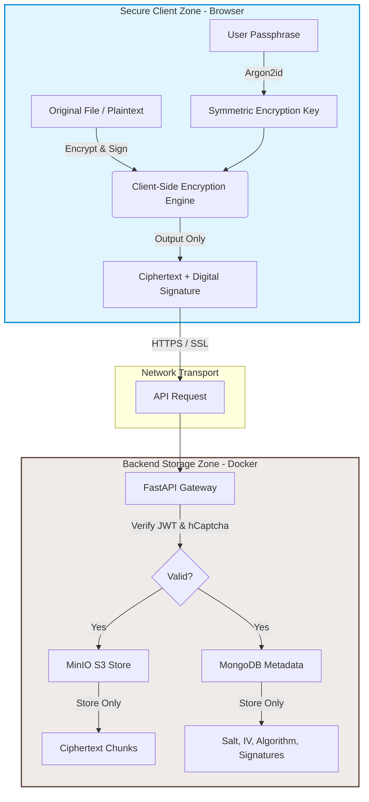
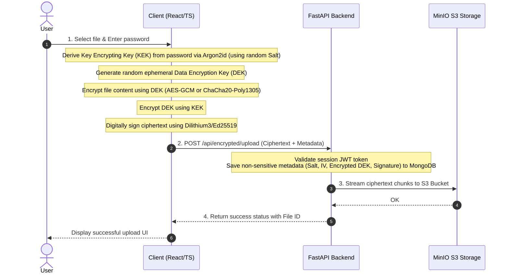
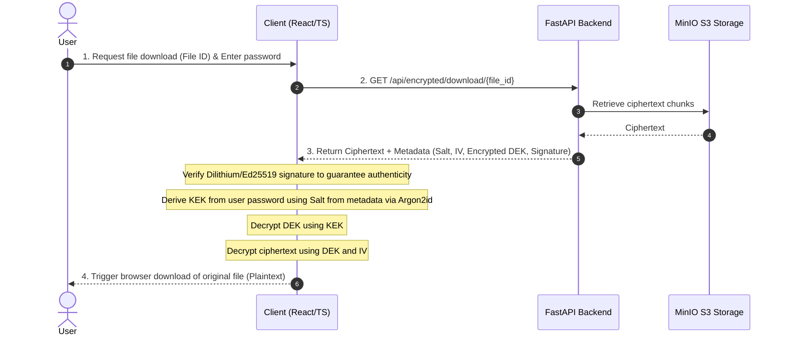

# 🔐 Zero-Knowledge File Encryption System

> **Post-Quantum Zero-Knowledge File Encryption System**. All encryption, decryption, and signing operations occur 100% on the client side (browser). The server acts solely as a "blind" storage vault for encrypted payloads and non-sensitive metadata.

Vietnamese version: 🇻🇳 [Tiếng Việt](./README-vi.md)

[](docker-compose.yml)
[](backend/)
[](frontend/)
[](LICENSE)

---

## 1. The Problem & The Solution

When storing files on traditional cloud storage providers (such as Google Drive, Dropbox, or standard AWS S3):
1. **Loss of Key Control:** Data is encrypted server-side (SSE), meaning the cloud provider holds the decryption keys. If their infrastructure is compromised or subpoenaed, your data is exposed.
2. **The Quantum Threat:** Current public-key cryptography (such as RSA, ECC, Diffie-Hellman) used for key exchange and digital signatures can be completely broken in the near future by Shor's algorithm running on quantum computers.

### Our Solution:
* **Zero-Knowledge Architecture:** Encryption keys are derived directly from the user's password using the memory-hard **Argon2id** hashing algorithm directly in the browser. This key exists only temporarily in the client device's RAM and is **never** sent over the network or stored on the backend.
* **Post-Quantum Cryptography (PQC):** Integrated hybrid quantum-resistant key encapsulation (**Kyber1024** + X25519) and quantum-resistant digital signatures (**Dilithium3/5** + Ed25519) to secure files against future decryption attacks ("Harvest Now, Decrypt Later").

---

## 2. System Architecture

The diagram below illustrates the absolute separation between the sensitive data zone (Client-side) and the storage zone (Server-side):



---

## 3. Core Processing Flows

### File Encryption & Upload Flow
Preparing encrypted payloads happens entirely in the browser's memory before initiating any network connections:



### File Download & Decryption Flow
To retrieve and read the files, the client downloads the encrypted payload and decrypts it locally:



---

## 4. Notable Features

* **Large File Streaming (Chunked Encryption):** For files larger than 50MB, the client automatically splits the file into 1MB–10MB chunks, encrypts them on-the-fly, and streams them to the backend to prevent browser tab crashes from memory overload.
* **Directory Structure Preservation:** Easily drag and drop folders. The system compresses folder structures into ZIP packages at the client level, encrypts the ZIP, and unpacks the directory layout automatically upon successful decryption.
* **Multi-Factor Authentication (2FA) & Rate Limiting:** Built-in email-based OTP 2FA, brute-force protection (lockout after 5 failed login attempts), and mandatory **hCaptcha** integration for suspicious requests.
* **Offline Portable Packages:** Export encrypted files with their metadata into a standalone `.encrypted` package. Users can decrypt these packages locally without needing access to the backend API.

---

## 5. Tech Stack & Engineering Architecture

The application is structured as a containerized, service-oriented architecture:

* **Frontend:** React 18 (TypeScript), Vite (high-performance build tool), Material-UI (UI component library), Tailwind CSS (responsive styling).
* **Client Cryptography Core:**
  * `Web Crypto API` for native hardware-accelerated symmetric AES-GCM operations.
  * `@noble/ciphers` & `@noble/post-quantum` for pure JS/TS implementations of post-quantum cryptography (Kyber1024, Dilithium).
  * `libsodium-wrappers` for industry-standard primitives (ChaCha20-Poly1305, Ed25519).
  * `argon2-browser` WebAssembly (Wasm) port for high-performance Argon2id password-based key derivation.
* **Backend:** FastAPI (Python 3.11) async gateway, utilizing Pydantic v2 for data schema modeling and validation.
* **Database & Storage:**
  * **MongoDB 6.0:** Holds accounts, audit logs, and file metadata.
  * **MinIO S3 Store:** Fast, private S3-compatible local object storage server.

---

## 6. Getting Started (Docker Compose)

The only requirements to run the entire stack are **Docker** and **Docker Compose**.

### Step 1: Clone the repository
```bash
git clone https://github.com/<your-username>/zero-knowledge-pqc-file-encryption.git
cd zero-knowledge-pqc-file-encryption
```

### Step 2: Configure environment variables
Copy the template file:
```bash
cp .env.example .env
```
Open `.env` and fill in the required parameters:
* `SECRET_KEY`: Used to sign JWTs. Generate a strong random key:
  ```bash
  python -c "import secrets; print(secrets.token_hex(32))"
  ```
* `MONGO_ROOT_PASSWORD`: Root credentials for the MongoDB instance.
* `MINIO_ACCESS_KEY` & `MINIO_SECRET_KEY`: Credentials for access to the MinIO console and S3 storage API.
* `SMTP_USERNAME` & `SMTP_PASSWORD`: Your SMTP details (e.g., Gmail App Password) for sending OTP emails.

### Step 3: Run the stack
Build and start all services in detached mode:
```bash
docker compose up -d --build
```

### Step 4: Access services
Once containers display a `healthy` status (approx. 1-2 minutes on first run):

* **User Interface (Frontend):** [http://localhost:3000](http://localhost:3000)
* **Interactive API Docs (FastAPI):** [http://localhost:8000/docs](http://localhost:8000/docs)
* **Object Storage Console (MinIO):** [http://localhost:9001](http://localhost:9001)

### Commands reference:
* Check service status: `docker compose ps`
* Monitor logs: `docker compose logs -f`
* Stop services: `docker compose down`
* Reset all data (wipes volumes): `docker compose down -v`

---

## 7. Directory Structure & Components

```
.
├── backend/                   # 🐍 FastAPI Backend Application
│   ├── main.py                # Main entry point, CORS & Router registration
│   ├── requirements.txt       # Python backend dependencies
│   ├── Dockerfile             # Multi-stage production Python 3.11-slim
│   ├── app/
│   │   ├── api/               # API route handlers
│   │   │   ├── auth.py        # Authentication & OTP flows
│   │   │   ├── encrypted_file.py # File uploads, downloads, deletions
│   │   │   └── ...
│   │   ├── core/              # Global system configuration
│   │   │   ├── config.py      # Pydantic environment configuration
│   │   │   └── minio_client.py# S3 client helper & health checks
│   │   ├── services/          # Business logic layer
│   │   │   ├── encrypted_file_service.py
│   │   │   └── ...
│   │   └── database.py        # MongoDB connection setup
│   └── scripts/
│       └── setup_minio.py     # Script to automate S3 bucket creation
│
├── frontend/                  # ⚛️ React + TypeScript Frontend Application
│   ├── src/
│   │   ├── main.tsx           # React mounting point
│   │   ├── App.tsx            # Main router and theme configuration
│   │   ├── crypto/            # ⭐ Client-side cryptography core logic
│   │   │   ├── zero_knowledge.ts     # AES-GCM & Argon2id wrapper
│   │   │   ├── chunked_encryption.ts # Chunked streaming utilities
│   │   │   └── advanced_features.ts  # Kyber1024 & Dilithium signing
│   │   └── ...
│   ├── Dockerfile             # Production build on lightweight Nginx image
│   └── nginx.conf             # Nginx reverse-proxy & security headers config
│
├── docs/                      # 📚 System documentation
│   ├── API_DOCUMENTATION.md   # API specification reference
│   ├── SECURITY_GUIDE.md      # In-depth security architecture & Threat Model
│   └── SYSTEM-OVERVIEW.md     # High-level architecture overview
│
├── scripts/
│   ├── deploy.sh              # Automated deployment shell script
│   └── mongo-init.js          # DB index initialization for MongoDB
│
├── docker-compose.yml         # Main Docker Compose orchestration file
└── .gitignore                 # Excludes build artifacts & secrets from git
```

---

## 8. Development & Testing

To run quality checks on the code:

### Frontend Unit & Cryptographic Tests:
Tests are located under `frontend/src/__tests__` and mock cryptographic engines to verify performance, algorithms, and data integrity:
```bash
cd frontend
npm install
npm run test:run  # Execute cryptographic tests once
```

### Backend Integration Tests:
```bash
cd backend
python -m venv .venv
source .venv/bin/activate
pip install -r requirements.txt
pytest -v                  # Run backend tests
```

---

## 🛡️ Security Disclaimer
*This repository contains an academic research project. While cryptographic principles have been carefully designed and implemented, we strongly recommend performing comprehensive code reviews, penetration testing, and vulnerability assessments before using this codebase in a production environment containing sensitive user data.*
