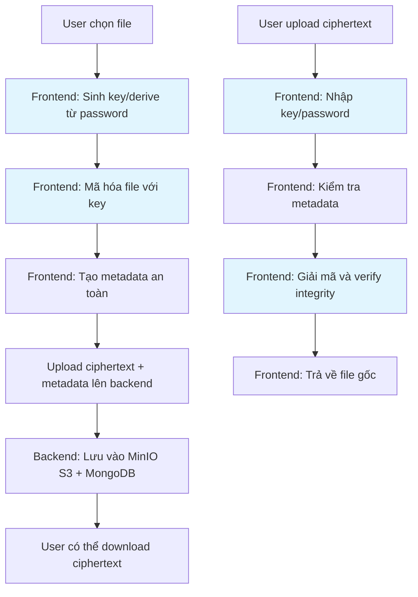

# Tổng Quan Hệ Thống Zero Knowledge File Encryption

## Giới Thiệu Hệ Thống

Hệ thống Zero Knowledge File Encryption là một web application/SPA chuyên về mã hóa và giải mã file, thư mục theo nguyên tắc Zero Knowledge. Hệ thống đảm bảo rằng không ai ngoài người dùng biết key/passphrase/private key, với mã hóa/giải mã 100% tại frontend và lưu trữ ciphertext trên backend cloud.

## Kiến Trúc Hệ Thống

```
┌─────────────────────────────────────────────────────────────┐
│                    FRONTEND (React/Vue SPA)                 │
├─────────────────────────────────────────────────────────────┤
│  ┌─────────────────┐  ┌─────────────────┐  ┌──────────────┐ │
│  │   Encryption    │  │   Decryption    │  │   Digital    │ │
│  │     Module      │  │     Module      │  │  Signature   │ │
│  └─────────────────┘  └─────────────────┘  └──────────────┘ │
│  ┌─────────────────┐  ┌─────────────────┐  ┌──────────────┐ │
│  │     Hybrid      │  │  Authentication │  │     UI/UX    │ │
│  │   Encryption    │  │     Module      │  │   Components │ │
│  └─────────────────┘  └─────────────────┘  └──────────────┘ │
│  ┌─────────────────────────────────────────────────────────┐ │
│  │           Frontend Crypto Engine (Zero Knowledge)       │ │
│  │  • AES-256-GCM • XChaCha20-Poly1305 • Camellia-CTR    │ │
│  │  • Ed25519 • Dilithium3/5 • X25519 • Kyber1024        │ │
│  │  • Argon2id • HMAC • SHA256/512                        │ │
│  └─────────────────────────────────────────────────────────┘ │
└─────────────────────────────────────────────────────────────┘
                                │
                                │ HTTPS API Calls
                                │ (Chỉ metadata + ciphertext)
                                ▼
┌─────────────────────────────────────────────────────────────┐
│                    BACKEND (FastAPI)                       │
├─────────────────────────────────────────────────────────────┤
│  ┌─────────────────┐  ┌─────────────────┐  ┌──────────────┐ │
│  │   API Gateway   │  │  Authentication │  │   Session    │ │
│  │   & Routing     │  │   & OTP         │  │  Management  │ │
│  └─────────────────┘  └─────────────────┘  └──────────────┘ │
│  ┌─────────────────┐  ┌─────────────────┐  ┌──────────────┐ │
│  │   File Upload   │  │   Metadata      │  │   Security   │ │
│  │   Management    │  │   Processing    │  │   & Logging  │ │
│  └─────────────────┘  └─────────────────┘  └──────────────┘ │
└─────────────────────────────────────────────────────────────┘
                                │
                                │ Data Storage
                                ▼
┌─────────────────────────────────────────────────────────────┐
│                      STORAGE LAYER                         │
├─────────────────────────────────────────────────────────────┤
│  ┌─────────────────────────────┐  ┌─────────────────────────┐ │
│  │        MongoDB              │  │       MinIO S3          │ │
│  │                             │  │                         │ │
│  │  • User metadata            │  │  • Encrypted files      │ │
│  │  • File metadata            │  │  • File chunks          │ │
│  │  • Session data             │  │  • Ciphertext only      │ │
│  │  • Activity logs            │  │  • No plaintext data    │ │
│  │  • Settings                 │  │                         │ │
│  └─────────────────────────────┘  └─────────────────────────┘ │
└─────────────────────────────────────────────────────────────┘
```

## Nguyên Tắc Zero Knowledge

### 1. Mã Hóa Tại Frontend
- Tất cả key, passphrase, private key chỉ tồn tại tạm thời trên thiết bị người dùng
- Không bao giờ truyền hoặc lưu key/passphrase lên backend
- Sử dụng Web Crypto API và thư viện crypto mạnh mẽ

### 2. Lưu Trữ Ciphertext
- Backend chỉ lưu trữ dữ liệu đã mã hóa (ciphertext)
- Metadata không chứa thông tin nhạy cảm về nội dung file
- Admin/developer không thể truy cập dữ liệu gốc

### 3. Kiểm Tra Toàn Vẹn
- Sử dụng AEAD (Authenticated Encryption with Associated Data)
- Checksum SHA256/512 cho mỗi file và chunk
- Signature verification cho tính xác thực

## Thư Mục Tài Liệu

| File | Mô Tả | Mục Đích |
|------|-------|----------|
| [`encryption.md`](./encryption.md) | Quy trình mã hóa file và thuật toán | Hướng dẫn chi tiết về các chế độ mã hóa |
| [`decryption.md`](./decryption.md) | Quy trình giải mã và kiểm tra toàn vẹn | Quy trình giải mã an toàn và xác thực |
| [`digital-signature.md`](./digital-signature.md) | Triển khai ký số Ed25519 và Dilithium | Bảo vệ tính xác thực và toàn vẹn |
| [`hybrid-encryption.md`](./hybrid-encryption.md) | Cơ chế KEM X25519/Kyber1024 | Mã hóa lai hiện đại và hậu lượng tử |
| [`backend-api.md`](./backend-api.md) | API endpoints và schema | Tài liệu API đầy đủ |
| [`storage.md`](./storage.md) | MongoDB metadata và MinIO S3 | Kiến trúc lưu trữ dữ liệu |
| [`frontend-crypto.md`](./frontend-crypto.md) | Cryptographic operations trên browser | Triển khai crypto tại client |
| [`authentication.md`](./authentication.md) | OTP, JWT và quản lý session | Hệ thống xác thực bảo mật |
| [`environment-config.md`](./environment-config.md) | Biến môi trường và cấu hình | Thiết lập hệ thống |
| [`testing-debugging.md`](./testing-debugging.md) | Quy trình test và debug | Kiểm thử và khắc phục sự cố |
| [`error-handling.md`](./error-handling.md) | Xử lý lỗi và troubleshooting | Giải quyết vấn đề thường gặp |
| [`deployment.md`](./deployment.md) | Triển khai production | Hướng dẫn deploy an toàn |

## Luồng Công Việc Zero Knowledge



## Ma Trận Tuân Thủ Zero Knowledge

| Module | Nguyên Tắc ZK | Triển Khai |
|--------|---------------|------------|
| Encryption | Key không rời khỏi client | ✅ Web Crypto API, libsodium.js |
| Decryption | Verify integrity trước khi decrypt | ✅ AEAD, HMAC verification |
| Digital Signature | Private key chỉ tại client | ✅ Ed25519, Dilithium local signing |
| Hybrid Encryption | KEM tại frontend | ✅ X25519, Kyber1024 client-side |
| Backend API | Chỉ nhận ciphertext | ✅ Không xử lý plaintext |
| Storage | Metadata không nhạy cảm | ✅ Tách biệt ciphertext/metadata |
| Authentication | Session không chứa crypto key | ✅ JWT, OTP riêng biệt |
| Frontend Crypto | Mọi crypto operation tại client | ✅ Browser-based crypto |

## Hướng Dẫn Bắt Đầu Nhanh

1. **Thiết Lập Môi Trường**: Xem [`environment-config.md`](./environment-config.md)
2. **Chạy Development**: Xem [`testing-debugging.md`](./testing-debugging.md)
3. **Hiểu Luồng Mã Hóa**: Xem [`encryption.md`](./encryption.md)
4. **Triển Khai Production**: Xem [`deployment.md`](./deployment.md)

## Liên Hệ và Hỗ Trợ

- **Tài liệu kỹ thuật**: Thư mục `docs/`
- **Mã nguồn**: Thư mục `frontend/` và `backend/`
- **Cấu hình**: File `.env` và `docker-compose.yml`
