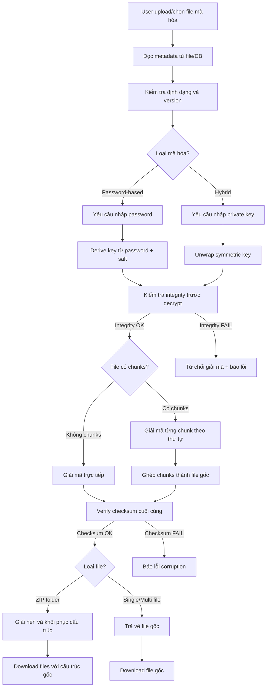

# Giải Mã File - Decryption Module

## Mục Đích và Phạm Vi

Module Decryption chịu trách nhiệm giải mã file, thư mục và multi-file một cách an toàn, với kiểm tra toàn vẹn nghiêm ngặt. Tất cả quá trình giải mã diễn ra 100% tại frontend, tuân thủ nguyên tắc Zero Knowledge.

## Sơ Đồ Luồng Dữ Liệu



## Các Chế Độ Giải Mã

### 1. Giải Mã File Đơn
**Mục đích**: Giải mã một file đã được mã hóa riêng lẻ
**Input**: Encrypted file + password/private key
**Output**: File gốc với tên và định dạng ban đầu

```typescript
interface SingleFileDecryption {
  encryptedFile: File | Blob;
  metadata: EncryptionMetadata;
  passphrase?: string;
  privateKey?: string;
}
```

**Quy trình thực hiện**:
1. Validate metadata format và version
2. Kiểm tra algorithm compatibility
3. Derive/unwrap decryption key
4. Verify authentication tag/HMAC
5. Decrypt content
6. Verify final checksum
7. Restore original filename và metadata

### 2. Giải Mã Multi-File
**Mục đích**: Giải mã nhiều file đã được mã hóa riêng biệt
**Input**: Danh sách encrypted files + credentials
**Output**: Tất cả file gốc với thứ tự và tên đúng

```typescript
interface MultiFileDecryption {
  encryptedFiles: EncryptedFileInfo[];
  credentials: DecryptionCredentials;
  preserveOrder: boolean;
}

interface EncryptedFileInfo {
  file: File;
  metadata: EncryptionMetadata;
  originalIndex: number;
}
```

**Đặc điểm**:
- Giải mã song song để tối ưu performance
- Maintain thứ tự file gốc
- Rollback nếu bất kỳ file nào fail
- Progress tracking cho từng file

### 3. Giải Mã Thư Mục (ZIP)
**Mục đích**: Giải mã và khôi phục cấu trúc thư mục
**Input**: Encrypted ZIP file + credentials
**Output**: Toàn bộ cấu trúc thư mục gốc

```typescript
interface FolderDecryption {
  encryptedZip: File;
  metadata: FolderMetadata;
  credentials: DecryptionCredentials;
  extractPath?: string;
}
```

**Quy trình**:
1. Giải mã ZIP file như file đơn
2. Parse ZIP content bằng JSZip
3. Validate cấu trúc thư mục từ metadata
4. Extract files với đúng relative path
5. Restore timestamps và permissions
6. Verify toàn bộ cấu trúc

## Thuật Toán Giải Mã

### AES-256-GCM Decryption
```typescript
async function decryptAES256GCM(
  encryptedData: ArrayBuffer, 
  key: CryptoKey, 
  iv: Uint8Array
): Promise<ArrayBuffer> {
  try {
    const decrypted = await crypto.subtle.decrypt(
      { name: 'AES-GCM', iv: iv },
      key,
      encryptedData
    );
    return decrypted;
  } catch (error) {
    throw new Error('Authentication verification failed');
  }
}
```

**Đặc điểm**:
- Tự động verify authentication tag
- Throw error nếu data bị tamper
- High performance với hardware acceleration

### XChaCha20-Poly1305 Decryption
```typescript
import { xchacha20poly1305 } from '@noble/ciphers/chacha';

function decryptXChaCha20(
  encryptedData: Uint8Array, 
  key: Uint8Array, 
  nonce: Uint8Array
): Uint8Array {
  const cipher = xchacha20poly1305(key, nonce);
  try {
    return cipher.decrypt(encryptedData);
  } catch (error) {
    throw new Error('Decryption failed - invalid key or corrupted data');
  }
}
```

### Camellia-CTR + HMAC Verification
```typescript
async function decryptCamellia(
  encryptedData: Uint8Array, 
  signature: ArrayBuffer,
  key: Uint8Array, 
  iv: Uint8Array
): Promise<Uint8Array> {
  // Verify HMAC trước khi decrypt
  const hmacKey = await crypto.subtle.importKey(
    'raw', key.slice(0, 32),
    { name: 'HMAC', hash: 'SHA-256' },
    false, ['verify']
  );
  
  const isValid = await crypto.subtle.verify(
    'HMAC', hmacKey, signature, encryptedData
  );
  
  if (!isValid) {
    throw new Error('HMAC verification failed');
  }
  
  // Decrypt sau khi verify
  return camelliaDecrypt(encryptedData, key, iv);
}
```

## Xử Lý Chunks

### Giải Mã Chunks Tuần Tự
```typescript
async function decryptFileChunks(
  chunks: EncryptedChunk[], 
  credentials: DecryptionCredentials
): Promise<Uint8Array> {
  // Sắp xếp chunks theo index
  chunks.sort((a, b) => a.index - b.index);
  
  const decryptedChunks: Uint8Array[] = [];
  
  for (const chunk of chunks) {
    // Verify chunk integrity trước
    const calculatedHash = await calculateSHA256(chunk.encrypted);
    if (calculatedHash !== chunk.checksum) {
      throw new Error(`Chunk ${chunk.index} integrity check failed`);
    }
    
    // Decrypt chunk
    const decrypted = await decryptChunk(chunk, credentials);
    decryptedChunks.push(decrypted);
  }
  
  // Ghép tất cả chunks
  return concatenateChunks(decryptedChunks);
}
```

### Parallel Chunk Processing
```typescript
async function decryptChunksParallel(
  chunks: EncryptedChunk[],
  credentials: DecryptionCredentials,
  maxConcurrency: number = 4
): Promise<Uint8Array> {
  const semaphore = new Semaphore(maxConcurrency);
  
  const decryptPromises = chunks.map(async (chunk) => {
    await semaphore.acquire();
    try {
      return await decryptChunk(chunk, credentials);
    } finally {
      semaphore.release();
    }
  });
  
  const decryptedChunks = await Promise.all(decryptPromises);
  return concatenateChunks(decryptedChunks);
}
```

## Phương Thức Giải Mã

### 1. Giải Mã Với Mật Khẩu
```typescript
async function decryptWithPassword(
  encryptedData: ArrayBuffer,
  metadata: EncryptionMetadata,
  passphrase: string
): Promise<ArrayBuffer> {
  // Validate metadata
  if (!metadata.salt || !metadata.iv) {
    throw new Error('Invalid metadata - missing salt or IV');
  }
  
  // Derive key với cùng parameters
  const key = await argon2id({
    password: passphrase,
    salt: new Uint8Array(metadata.salt),
    parallelism: metadata.kdfParams?.parallelism || 1,
    iterations: metadata.kdfParams?.iterations || 3,
    memorySize: metadata.kdfParams?.memorySize || 64 * 1024,
    hashLength: 32,
    outputType: 'binary'
  });
  
  // Decrypt với algorithm tương ứng
  switch (metadata.algorithm) {
    case 'AES-256-GCM':
      return await decryptAES256GCM(
        encryptedData, 
        key, 
        new Uint8Array(metadata.iv)
      );
    case 'XChaCha20-Poly1305':
      return decryptXChaCha20(
        new Uint8Array(encryptedData),
        key,
        new Uint8Array(metadata.iv)
      );
    default:
      throw new Error(`Unsupported algorithm: ${metadata.algorithm}`);
  }
}
```

### 2. Giải Mã Lai (Hybrid)
```typescript
async function decryptWithPrivateKey(
  encryptedData: ArrayBuffer,
  metadata: HybridMetadata,
  privateKey: string
): Promise<ArrayBuffer> {
  // Unwrap symmetric key
  let symmetricKey: Uint8Array;
  
  switch (metadata.keyType) {
    case 'X25519':
      symmetricKey = await x25519Decrypt(metadata.wrappedKey, privateKey);
      break;
    case 'Kyber1024':
      symmetricKey = await kyberDecrypt(metadata.wrappedKey, privateKey);
      break;
    default:
      throw new Error(`Unsupported key type: ${metadata.keyType}`);
  }
  
  // Decrypt file với symmetric key
  return await decryptAES256GCM(
    encryptedData,
    symmetricKey,
    new Uint8Array(metadata.iv)
  );
}
```

## Kiểm Tra Toàn Vẹn

### Pre-Decryption Validation
```typescript
async function validateBeforeDecryption(
  encryptedFile: File,
  metadata: EncryptionMetadata
): Promise<boolean> {
  // Kiểm tra file size consistency
  if (encryptedFile.size !== metadata.encryptedSize) {
    throw new Error('File size mismatch');
  }
  
  // Kiểm tra format version
  if (!isCompatibleVersion(metadata.version)) {
    throw new Error('Incompatible format version');
  }
  
  // Kiểm tra algorithm support
  if (!isSupportedAlgorithm(metadata.algorithm)) {
    throw new Error('Unsupported encryption algorithm');
  }
  
  return true;
}
```

### Post-Decryption Verification
```typescript
async function verifyDecryptedData(
  decryptedData: ArrayBuffer,
  expectedChecksum: string
): Promise<boolean> {
  const actualChecksum = await calculateSHA256(decryptedData);
  
  if (actualChecksum !== expectedChecksum) {
    throw new Error('Decrypted data checksum mismatch - possible corruption');
  }
  
  return true;
}
```

### Integrity Check Pipeline
```typescript
async function fullIntegrityCheck(
  encryptedFile: File,
  metadata: EncryptionMetadata,
  decryptedData: ArrayBuffer
): Promise<void> {
  // 1. Pre-decryption checks
  await validateBeforeDecryption(encryptedFile, metadata);
  
  // 2. Verify encrypted data hasn't been tampered
  if (metadata.encryptedChecksum) {
    const encryptedHash = await calculateSHA256(await encryptedFile.arrayBuffer());
    if (encryptedHash !== metadata.encryptedChecksum) {
      throw new Error('Encrypted file has been modified');
    }
  }
  
  // 3. Post-decryption verification
  await verifyDecryptedData(decryptedData, metadata.checksum);
  
  // 4. Additional checks for specific file types
  if (metadata.mimeType) {
    await validateFileType(decryptedData, metadata.mimeType);
  }
}
```

## Xử Lý Lỗi và Recovery

### Error Types
```typescript
enum DecryptionErrorType {
  INVALID_CREDENTIALS = 'INVALID_CREDENTIALS',
  CORRUPTED_DATA = 'CORRUPTED_DATA',
  UNSUPPORTED_FORMAT = 'UNSUPPORTED_FORMAT',
  INTEGRITY_FAILURE = 'INTEGRITY_FAILURE',
  INSUFFICIENT_MEMORY = 'INSUFFICIENT_MEMORY'
}

class DecryptionError extends Error {
  constructor(
    public type: DecryptionErrorType,
    message: string,
    public metadata?: any
  ) {
    super(message);
    this.name = 'DecryptionError';
  }
}
```

### Error Handling Strategy
```typescript
async function safeDecryption(
  encryptedFile: File,
  credentials: DecryptionCredentials
): Promise<DecryptionResult> {
  try {
    // Attempt normal decryption
    return await performDecryption(encryptedFile, credentials);
  } catch (error) {
    if (error instanceof DecryptionError) {
      switch (error.type) {
        case DecryptionErrorType.INVALID_CREDENTIALS:
          throw new Error('Mật khẩu hoặc private key không đúng');
        case DecryptionErrorType.CORRUPTED_DATA:
          throw new Error('Dữ liệu bị hỏng hoặc không đầy đủ');
        case DecryptionErrorType.INTEGRITY_FAILURE:
          throw new Error('Kiểm tra toàn vẹn thất bại - file có thể bị chỉnh sửa');
        default:
          throw new Error('Lỗi không xác định trong quá trình giải mã');
      }
    }
    throw error;
  }
}
```

## Tối Ưu Performance

### Memory Management
```typescript
class DecryptionManager {
  private maxMemoryUsage = 512 * 1024 * 1024; // 512MB
  private currentMemoryUsage = 0;
  
  async decryptLargeFile(file: File, credentials: DecryptionCredentials) {
    if (file.size > this.maxMemoryUsage) {
      return await this.streamDecryption(file, credentials);
    } else {
      return await this.bufferDecryption(file, credentials);
    }
  }
  
  private async streamDecryption(file: File, credentials: DecryptionCredentials) {
    // Implement streaming decryption for large files
    const reader = file.stream().getReader();
    const writer = new WritableStream();
    
    // Process in chunks to avoid memory overflow
    // ...
  }
}
```

### Worker Thread Integration
```typescript
// decryption-worker.ts
self.onmessage = async (event) => {
  const { chunk, credentials, algorithm } = event.data;
  
  try {
    const decrypted = await decryptChunk(chunk, credentials, algorithm);
    self.postMessage({ success: true, data: decrypted });
  } catch (error) {
    self.postMessage({ success: false, error: error.message });
  }
};

// main thread
async function decryptWithWorkers(chunks: EncryptedChunk[]) {
  const workers = Array.from({ length: 4 }, () => 
    new Worker('./decryption-worker.js')
  );
  
  // Distribute chunks across workers
  // ...
}
```

## Tích Hợp Với Các Module Khác

### Với Digital Signature Module
```typescript
async function decryptAndVerifySignature(
  encryptedFile: File,
  signature: DigitalSignature,
  credentials: DecryptionCredentials
): Promise<DecryptionResult> {
  // 1. Verify signature trước khi decrypt
  const isValidSignature = await verifySignature(encryptedFile, signature);
  if (!isValidSignature) {
    throw new Error('Invalid digital signature');
  }
  
  // 2. Proceed with decryption
  const result = await decryptFile(encryptedFile, credentials);
  
  // 3. Verify signature của decrypted data nếu có
  if (signature.dataSignature) {
    await verifyDataSignature(result.data, signature.dataSignature);
  }
  
  return result;
}
```

### Với Storage Module
```typescript
async function decryptFromStorage(
  fileId: string,
  credentials: DecryptionCredentials
): Promise<DecryptionResult> {
  // 1. Fetch metadata từ MongoDB
  const metadata = await fetchFileMetadata(fileId);
  
  // 2. Download encrypted data từ MinIO
  const encryptedData = await downloadEncryptedFile(fileId);
  
  // 3. Perform decryption
  return await decryptFile(encryptedData, metadata, credentials);
}
```

## Tuân Thủ Zero Knowledge

### ✅ Nguyên Tắc Được Đảm Bảo
- Private key/password chỉ tồn tại tại client
- Backend không bao giờ nhìn thấy decrypted data
- Decryption hoàn toàn tại frontend
- Secure memory cleanup sau decryption

### ⚠️ Lưu Ý Bảo Mật
```typescript
// Secure cleanup sau decryption
function secureCleanup(sensitiveData: ArrayBuffer) {
  // Overwrite memory với random data
  const view = new Uint8Array(sensitiveData);
  crypto.getRandomValues(view);
  
  // Clear references
  sensitiveData = null;
  
  // Force garbage collection nếu có thể
  if (window.gc) {
    window.gc();
  }
}
```

## Ví Dụ Triển Khai

### Giải Mã File Đơn Giản
```typescript
import { decryptFile } from './decryption-service';

async function handleFileDecryption(encryptedFile: File, password: string) {
  try {
    const result = await decryptFile({
      file: encryptedFile,
      passphrase: password
    });
    
    // Download file gốc
    downloadFile(result.data, result.originalName);
    
    return result;
  } catch (error) {
    console.error('Lỗi giải mã:', error);
    throw error;
  }
}
```

### Giải Mã Với Progress Tracking
```typescript
async function decryptWithProgress(
  encryptedFile: File, 
  password: string,
  onProgress: (progress: number) => void
) {
  const metadata = await readMetadata(encryptedFile);
  
  if (metadata.chunks) {
    let completed = 0;
    const chunks = await loadChunks(encryptedFile);
    
    for (const chunk of chunks) {
      await decryptChunk(chunk, password);
      completed++;
      onProgress((completed / chunks.length) * 100);
    }
  } else {
    // Single file decryption với progress simulation
    await decryptSingleFile(encryptedFile, password, onProgress);
  }
}
```
