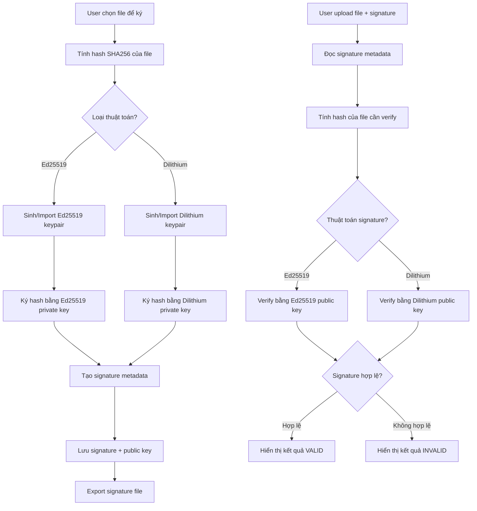

# Chữ Ký Số - Digital Signature Module

## Mục Đích và Phạm Vi

Module Digital Signature cung cấp khả năng ký số và xác thực file sử dụng các thuật toán hiện đại và hậu lượng tử. Hỗ trợ Ed25519 (classical) và Dilithium3/5 (post-quantum), đảm bảo tính xác thực và toàn vẹn của dữ liệu theo nguyên tắc Zero Knowledge.

## Sơ Đồ Luồng Dữ Liệu



## Thuật Toán Chữ Ký Số

### 1. Ed25519 (Classical Digital Signature)
**Đặc điểm**:
- Key size: 32 bytes (private), 32 bytes (public)
- Signature size: 64 bytes
- Hiệu suất cao, bảo mật mạnh
- Kháng collision và forgery attacks
- Deterministic signature

```typescript
import { ed25519 } from '@noble/curves/ed25519';

interface Ed25519KeyPair {
  privateKey: Uint8Array; // 32 bytes
  publicKey: Uint8Array;  // 32 bytes
}

async function generateEd25519KeyPair(): Promise<Ed25519KeyPair> {
  const privateKey = ed25519.utils.randomPrivateKey();
  const publicKey = ed25519.getPublicKey(privateKey);
  
  return {
    privateKey,
    publicKey
  };
}

async function signWithEd25519(
  data: Uint8Array, 
  privateKey: Uint8Array
): Promise<Uint8Array> {
  return ed25519.sign(data, privateKey);
}

async function verifyEd25519(
  signature: Uint8Array,
  data: Uint8Array,
  publicKey: Uint8Array
): Promise<boolean> {
  return ed25519.verify(signature, data, publicKey);
}
```

### 2. Dilithium3 (Post-Quantum Digital Signature)
**Đặc điểm**:
- Key size: ~1312 bytes (private), ~1952 bytes (public)
- Signature size: ~2420 bytes
- Kháng lượng tử (quantum-resistant)
- NIST standardized algorithm
- Lattice-based cryptography

```typescript
import { Dilithium3 } from 'pqcrypto-js';

interface Dilithium3KeyPair {
  privateKey: Uint8Array; // ~1312 bytes
  publicKey: Uint8Array;  // ~1952 bytes
}

async function generateDilithium3KeyPair(): Promise<Dilithium3KeyPair> {
  const keyPair = await Dilithium3.keyPair();
  return {
    privateKey: keyPair.privateKey,
    publicKey: keyPair.publicKey
  };
}

async function signWithDilithium3(
  data: Uint8Array,
  privateKey: Uint8Array
): Promise<Uint8Array> {
  return await Dilithium3.sign(data, privateKey);
}

async function verifyDilithium3(
  signature: Uint8Array,
  data: Uint8Array,
  publicKey: Uint8Array
): Promise<boolean> {
  return await Dilithium3.verify(signature, data, publicKey);
}
```

### 3. Dilithium5 (High Security Post-Quantum)
**Đặc điểm**:
- Key size: ~2528 bytes (private), ~2592 bytes (public)
- Signature size: ~4595 bytes
- Bảo mật cao nhất trong họ Dilithium
- Phù hợp cho dữ liệu cực kỳ nhạy cảm

```typescript
import { Dilithium5 } from 'pqcrypto-js';

interface Dilithium5KeyPair {
  privateKey: Uint8Array; // ~2528 bytes
  publicKey: Uint8Array;  // ~2592 bytes
}

async function generateDilithium5KeyPair(): Promise<Dilithium5KeyPair> {
  const keyPair = await Dilithium5.keyPair();
  return {
    privateKey: keyPair.privateKey,
    publicKey: keyPair.publicKey
  };
}
```

## Cấu Trúc Signature Metadata

### Signature Format
```typescript
interface DigitalSignature {
  // Signature data
  signature: Uint8Array;
  algorithm: 'Ed25519' | 'Dilithium3' | 'Dilithium5';
  
  // Public key for verification
  publicKey: Uint8Array;
  
  // File information
  fileHash: string;        // SHA256 của file gốc
  fileName: string;        // Tên file được ký
  fileSize: number;        // Kích thước file
  mimeType?: string;       // MIME type của file
  
  // Signature metadata
  timestamp: string;       // Thời gian ký (ISO string)
  signerInfo?: {
    name?: string;
    email?: string;
    organization?: string;
  };
  
  // Version và compatibility
  version: string;         // Version của signature format
  compatibility: string[]; // Danh sách version tương thích
}
```

### Signature File Format
```typescript
interface SignatureFile {
  header: {
    magic: 'ZKFS_SIG';     // Magic bytes để identify
    version: string;
    algorithm: string;
  };
  
  signature: DigitalSignature;
  
  // Optional: Embedded original file (cho portable signature)
  embeddedFile?: {
    data: Uint8Array;
    compressed: boolean;
  };
  
  // Checksum của toàn bộ signature file
  checksum: string;
}
```

## Quy Trình Ký Số

### 1. Chuẩn Bị Dữ Liệu
```typescript
async function prepareDataForSigning(file: File): Promise<{
  fileHash: string;
  fileData: Uint8Array;
  metadata: FileMetadata;
}> {
  // Đọc file content
  const fileData = new Uint8Array(await file.arrayBuffer());
  
  // Tính hash SHA256
  const hashBuffer = await crypto.subtle.digest('SHA-256', fileData);
  const fileHash = Array.from(new Uint8Array(hashBuffer))
    .map(b => b.toString(16).padStart(2, '0'))
    .join('');
  
  // Tạo metadata
  const metadata: FileMetadata = {
    name: file.name,
    size: file.size,
    type: file.type,
    lastModified: file.lastModified
  };
  
  return { fileHash, fileData, metadata };
}
```

### 2. Thực Hiện Ký Số
```typescript
async function signFile(
  file: File,
  algorithm: 'Ed25519' | 'Dilithium3' | 'Dilithium5',
  privateKey: Uint8Array,
  publicKey: Uint8Array,
  signerInfo?: SignerInfo
): Promise<DigitalSignature> {
  // Chuẩn bị dữ liệu
  const { fileHash, fileData, metadata } = await prepareDataForSigning(file);
  
  // Tạo data để ký (hash + metadata)
  const dataToSign = new TextEncoder().encode(
    JSON.stringify({
      fileHash,
      fileName: metadata.name,
      fileSize: metadata.size,
      timestamp: new Date().toISOString()
    })
  );
  
  // Ký dữ liệu
  let signature: Uint8Array;
  switch (algorithm) {
    case 'Ed25519':
      signature = await signWithEd25519(dataToSign, privateKey);
      break;
    case 'Dilithium3':
      signature = await signWithDilithium3(dataToSign, privateKey);
      break;
    case 'Dilithium5':
      signature = await signWithDilithium5(dataToSign, privateKey);
      break;
    default:
      throw new Error(`Unsupported algorithm: ${algorithm}`);
  }
  
  // Tạo signature object
  const digitalSignature: DigitalSignature = {
    signature,
    algorithm,
    publicKey,
    fileHash,
    fileName: metadata.name,
    fileSize: metadata.size,
    mimeType: metadata.type,
    timestamp: new Date().toISOString(),
    signerInfo,
    version: '1.0',
    compatibility: ['1.0']
  };
  
  return digitalSignature;
}
```

### 3. Export Signature File
```typescript
async function exportSignatureFile(
  signature: DigitalSignature,
  includeOriginalFile: boolean = false,
  originalFileData?: Uint8Array
): Promise<Blob> {
  const signatureFile: SignatureFile = {
    header: {
      magic: 'ZKFS_SIG',
      version: signature.version,
      algorithm: signature.algorithm
    },
    signature
  };
  
  // Embed original file nếu được yêu cầu
  if (includeOriginalFile && originalFileData) {
    signatureFile.embeddedFile = {
      data: originalFileData,
      compressed: false // Có thể implement compression
    };
  }
  
  // Serialize và tính checksum
  const serialized = JSON.stringify(signatureFile);
  const checksum = await calculateSHA256(new TextEncoder().encode(serialized));
  signatureFile.checksum = checksum;
  
  // Tạo final blob
  const finalSerialized = JSON.stringify(signatureFile);
  return new Blob([finalSerialized], { type: 'application/json' });
}
```

## Quy Trình Xác Thực

### 1. Load và Validate Signature File
```typescript
async function loadSignatureFile(signatureFile: File): Promise<SignatureFile> {
  const content = await signatureFile.text();
  
  try {
    const parsed: SignatureFile = JSON.parse(content);
    
    // Validate magic header
    if (parsed.header.magic !== 'ZKFS_SIG') {
      throw new Error('Invalid signature file format');
    }
    
    // Validate version compatibility
    if (!isCompatibleVersion(parsed.header.version)) {
      throw new Error('Incompatible signature version');
    }
    
    // Verify checksum
    const { checksum, ...dataToHash } = parsed;
    const calculatedChecksum = await calculateSHA256(
      new TextEncoder().encode(JSON.stringify(dataToHash))
    );
    
    if (calculatedChecksum !== checksum) {
      throw new Error('Signature file checksum mismatch');
    }
    
    return parsed;
  } catch (error) {
    throw new Error(`Failed to parse signature file: ${error.message}`);
  }
}
```

### 2. Verify Digital Signature
```typescript
async function verifyDigitalSignature(
  file: File,
  signatureFile: SignatureFile
): Promise<VerificationResult> {
  const signature = signatureFile.signature;
  
  // Tính hash của file hiện tại
  const { fileHash } = await prepareDataForSigning(file);
  
  // Kiểm tra file hash match
  if (fileHash !== signature.fileHash) {
    return {
      isValid: false,
      error: 'File has been modified since signing',
      details: {
        expectedHash: signature.fileHash,
        actualHash: fileHash
      }
    };
  }
  
  // Tạo lại data đã được ký
  const dataToVerify = new TextEncoder().encode(
    JSON.stringify({
      fileHash: signature.fileHash,
      fileName: signature.fileName,
      fileSize: signature.fileSize,
      timestamp: signature.timestamp
    })
  );
  
  // Verify signature
  let isValidSignature: boolean;
  try {
    switch (signature.algorithm) {
      case 'Ed25519':
        isValidSignature = await verifyEd25519(
          signature.signature,
          dataToVerify,
          signature.publicKey
        );
        break;
      case 'Dilithium3':
        isValidSignature = await verifyDilithium3(
          signature.signature,
          dataToVerify,
          signature.publicKey
        );
        break;
      case 'Dilithium5':
        isValidSignature = await verifyDilithium5(
          signature.signature,
          dataToVerify,
          signature.publicKey
        );
        break;
      default:
        throw new Error(`Unsupported algorithm: ${signature.algorithm}`);
    }
  } catch (error) {
    return {
      isValid: false,
      error: `Signature verification failed: ${error.message}`
    };
  }
  
  return {
    isValid: isValidSignature,
    signature: signature,
    verifiedAt: new Date().toISOString()
  };
}
```

### 3. Verification Result
```typescript
interface VerificationResult {
  isValid: boolean;
  signature?: DigitalSignature;
  error?: string;
  details?: any;
  verifiedAt?: string;
}
```

## Key Management

### 1. Key Generation
```typescript
class KeyManager {
  async generateKeyPair(
    algorithm: 'Ed25519' | 'Dilithium3' | 'Dilithium5'
  ): Promise<{ privateKey: string; publicKey: string }> {
    let keyPair: any;
    
    switch (algorithm) {
      case 'Ed25519':
        keyPair = await generateEd25519KeyPair();
        break;
      case 'Dilithium3':
        keyPair = await generateDilithium3KeyPair();
        break;
      case 'Dilithium5':
        keyPair = await generateDilithium5KeyPair();
        break;
    }
    
    // Encode keys to base64 for storage/transport
    return {
      privateKey: this.encodeKey(keyPair.privateKey),
      publicKey: this.encodeKey(keyPair.publicKey)
    };
  }
  
  private encodeKey(key: Uint8Array): string {
    return btoa(String.fromCharCode(...key));
  }
  
  private decodeKey(encodedKey: string): Uint8Array {
    return new Uint8Array(
      atob(encodedKey).split('').map(char => char.charCodeAt(0))
    );
  }
}
```

### 2. Key Storage (Client-side Only)
```typescript
class SecureKeyStorage {
  private readonly STORAGE_KEY = 'zkfs_signature_keys';
  
  async storeKeyPair(
    algorithm: string,
    keyPair: { privateKey: string; publicKey: string },
    password: string
  ): Promise<void> {
    // Encrypt private key với password
    const encryptedPrivateKey = await this.encryptKey(
      keyPair.privateKey, 
      password
    );
    
    const keyData = {
      algorithm,
      publicKey: keyPair.publicKey,
      encryptedPrivateKey,
      createdAt: new Date().toISOString()
    };
    
    // Store in localStorage (hoặc IndexedDB cho security tốt hơn)
    localStorage.setItem(
      `${this.STORAGE_KEY}_${algorithm}`, 
      JSON.stringify(keyData)
    );
  }
  
  async loadKeyPair(
    algorithm: string,
    password: string
  ): Promise<{ privateKey: string; publicKey: string } | null> {
    const stored = localStorage.getItem(`${this.STORAGE_KEY}_${algorithm}`);
    if (!stored) return null;
    
    const keyData = JSON.parse(stored);
    const privateKey = await this.decryptKey(
      keyData.encryptedPrivateKey,
      password
    );
    
    return {
      privateKey,
      publicKey: keyData.publicKey
    };
  }
  
  private async encryptKey(key: string, password: string): Promise<string> {
    // Implement AES-GCM encryption với password-derived key
    // ...
  }
  
  private async decryptKey(encryptedKey: string, password: string): Promise<string> {
    // Implement AES-GCM decryption
    // ...
  }
}
```

## Tích Hợp Với Encryption Module

### Signing Encrypted Files
```typescript
async function signEncryptedFile(
  encryptedFile: File,
  encryptionMetadata: EncryptionMetadata,
  signingCredentials: SigningCredentials
): Promise<DigitalSignature> {
  // Ký cả encrypted file và metadata
  const combinedData = {
    encryptedFileHash: await calculateFileHash(encryptedFile),
    metadata: encryptionMetadata,
    timestamp: new Date().toISOString()
  };
  
  const dataToSign = new TextEncoder().encode(JSON.stringify(combinedData));
  
  return await signData(
    dataToSign,
    signingCredentials.algorithm,
    signingCredentials.privateKey,
    signingCredentials.publicKey
  );
}
```

### Verifying Signed Encrypted Files
```typescript
async function verifySignedEncryptedFile(
  encryptedFile: File,
  signature: DigitalSignature,
  expectedMetadata: EncryptionMetadata
): Promise<VerificationResult> {
  // Verify signature của encrypted file
  const result = await verifyDigitalSignature(encryptedFile, signature);
  
  if (!result.isValid) {
    return result;
  }
  
  // Additional verification cho encryption metadata
  // ...
  
  return result;
}
```

## Tuân Thủ Zero Knowledge

### ✅ Nguyên Tắc Được Đảm Bảo
- Private key chỉ tồn tại tại client
- Signature generation hoàn toàn offline
- Public key có thể chia sẻ an toàn
- Verification không cần private key

### ⚠️ Lưu Ý Bảo Mật
```typescript
// Secure cleanup sau signing
function secureCleanupSigningData(privateKey: Uint8Array, dataToSign: Uint8Array) {
  // Overwrite sensitive data
  crypto.getRandomValues(privateKey);
  crypto.getRandomValues(dataToSign);
  
  // Clear references
  privateKey = null;
  dataToSign = null;
}
```

## Ví Dụ Triển Khai

### Ký File Đơn Giản
```typescript
import { signFile, exportSignatureFile } from './digital-signature-service';

async function handleFileSigning(file: File, algorithm: string, privateKey: string) {
  try {
    const signature = await signFile(file, algorithm, privateKey);
    const signatureBlob = await exportSignatureFile(signature);
    
    // Download signature file
    downloadFile(signatureBlob, `${file.name}.sig`);
    
    return signature;
  } catch (error) {
    console.error('Lỗi ký file:', error);
    throw error;
  }
}
```

### Verify Signature
```typescript
async function handleSignatureVerification(file: File, signatureFile: File) {
  try {
    const result = await verifyDigitalSignature(file, signatureFile);
    
    if (result.isValid) {
      console.log('✅ Signature hợp lệ');
    } else {
      console.log('❌ Signature không hợp lệ:', result.error);
    }
    
    return result;
  } catch (error) {
    console.error('Lỗi verify signature:', error);
    throw error;
  }
}
```
