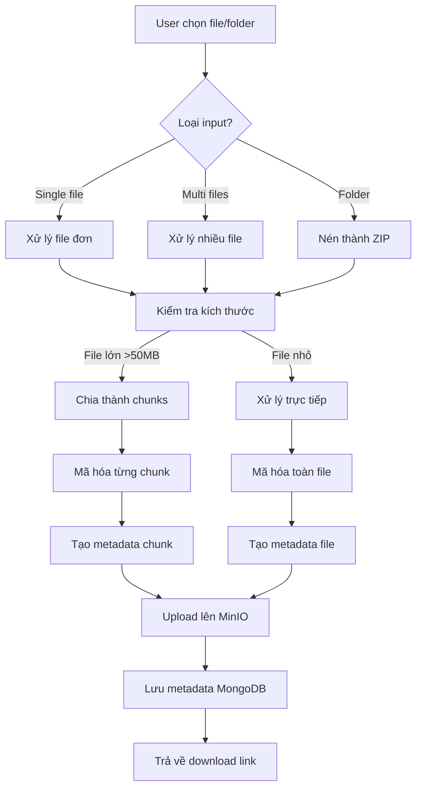

# Mã Hóa File - Encryption Module

## Mục Đích và Phạm Vi

Module Encryption chịu trách nhiệm mã hóa file, thư mục và multi-file theo nguyên tắc Zero Knowledge. Tất cả quá trình mã hóa diễn ra 100% tại frontend, đảm bảo key/passphrase không bao giờ rời khỏi thiết bị người dùng.

## Sơ Đồ Luồng Dữ Liệu



## Các Chế Độ Mã Hóa

### 1. Mã Hóa File Đơn
**Mục đích**: Mã hóa một file riêng lẻ
**Input**: File object từ file picker hoặc drag-drop
**Output**: Ciphertext + metadata

```typescript
interface SingleFileEncryption {
  file: File;
  algorithm: 'AES-256-GCM' | 'XChaCha20-Poly1305' | 'Camellia-CTR';
  passphrase?: string;
  publicKey?: string; // Cho hybrid encryption
}
```

**Quy trình thực hiện**:
1. Đọc file content bằng FileReader
2. Sinh salt ngẫu nhiên (16 bytes)
3. Derive key từ passphrase bằng Argon2id
4. Sinh IV/nonce ngẫu nhiên
5. Mã hóa content bằng thuật toán đã chọn
6. Tạo authentication tag (AEAD)
7. Tính checksum SHA256 của plaintext
8. Tạo metadata an toàn

### 2. Mã Hóa Multi-File
**Mục đích**: Mã hóa nhiều file riêng biệt
**Input**: FileList từ multiple file selection
**Output**: Nhiều ciphertext riêng biệt + metadata tương ứng

```typescript
interface MultiFileEncryption {
  files: FileList;
  algorithm: string;
  passphrase?: string;
  preserveOrder: boolean; // Giữ thứ tự file
}
```

**Đặc điểm**:
- Mỗi file được mã hóa riêng biệt với IV/salt riêng
- Metadata lưu thứ tự và mối quan hệ giữa các file
- Có thể giải mã từng file độc lập
- Hỗ trợ progress tracking cho từng file

### 3. Mã Hóa Thư Mục
**Mục đích**: Mã hóa toàn bộ cấu trúc thư mục
**Input**: Directory selection (webkitdirectory)
**Output**: ZIP file đã mã hóa + metadata cấu trúc

```typescript
interface FolderEncryption {
  directory: FileSystemDirectoryEntry;
  preserveStructure: boolean;
  compressionLevel: number;
}
```

**Quy trình**:
1. Duyệt toàn bộ cấu trúc thư mục
2. Sử dụng JSZip để tạo archive
3. Giữ nguyên relative path và cấu trúc
4. Nén ZIP với compression level tùy chọn
5. Mã hóa file ZIP như một file đơn
6. Lưu metadata cấu trúc thư mục

## Thuật Toán Mã Hóa

### AES-256-GCM (Authenticated Encryption)
```typescript
async function encryptAES256GCM(data: ArrayBuffer, key: CryptoKey, iv: Uint8Array) {
  const encrypted = await crypto.subtle.encrypt(
    { name: 'AES-GCM', iv: iv },
    key,
    data
  );
  return encrypted; // Bao gồm authentication tag
}
```

**Đặc điểm**:
- Key size: 256 bits
- IV size: 96 bits (12 bytes)
- Authentication tag: 128 bits
- Hiệu suất cao, hỗ trợ hardware acceleration

### XChaCha20-Poly1305 (Stream Cipher + MAC)
```typescript
import { xchacha20poly1305 } from '@noble/ciphers/chacha';

function encryptXChaCha20(data: Uint8Array, key: Uint8Array, nonce: Uint8Array) {
  const cipher = xchacha20poly1305(key, nonce);
  return cipher.encrypt(data);
}
```

**Đặc điểm**:
- Key size: 256 bits
- Nonce size: 192 bits (24 bytes)
- Kháng lượng tử tốt hơn AES
- Phù hợp cho streaming data

### Camellia-CTR + HMAC
```typescript
async function encryptCamellia(data: Uint8Array, key: Uint8Array, iv: Uint8Array) {
  // Mã hóa bằng Camellia-CTR
  const encrypted = camelliaEncrypt(data, key, iv);
  
  // Tạo HMAC cho authentication
  const hmacKey = await crypto.subtle.importKey(
    'raw', key.slice(0, 32), 
    { name: 'HMAC', hash: 'SHA-256' }, 
    false, ['sign']
  );
  const signature = await crypto.subtle.sign('HMAC', hmacKey, encrypted);
  
  return { encrypted, signature };
}
```

## Chunking và Streaming

### Cấu Hình Chunking
```typescript
const CHUNK_CONFIG = {
  threshold: 50 * 1024 * 1024, // 50MB
  chunkSize: 5 * 1024 * 1024,  // 5MB per chunk
  maxChunks: 1000,             // Giới hạn số chunk
  bufferSize: 1024 * 1024      // 1MB buffer
};
```

### Quy Trình Chunking
1. **Kiểm tra kích thước**: File > threshold → chunking
2. **Chia chunk**: Sử dụng Blob.slice()
3. **Mã hóa song song**: Worker threads cho performance
4. **Metadata chunk**: Lưu thứ tự, offset, checksum
5. **Upload tuần tự**: Đảm bảo integrity

```typescript
async function encryptFileChunks(file: File, passphrase: string) {
  const chunks = [];
  const chunkSize = CHUNK_CONFIG.chunkSize;
  
  for (let offset = 0; offset < file.size; offset += chunkSize) {
    const chunk = file.slice(offset, offset + chunkSize);
    const chunkData = await chunk.arrayBuffer();
    
    // Mã hóa chunk với IV riêng
    const iv = crypto.getRandomValues(new Uint8Array(12));
    const encrypted = await encryptChunk(chunkData, passphrase, iv);
    
    chunks.push({
      index: Math.floor(offset / chunkSize),
      offset: offset,
      size: chunk.size,
      iv: Array.from(iv),
      encrypted: encrypted,
      checksum: await calculateSHA256(chunkData)
    });
  }
  
  return chunks;
}
```

## Phương Thức Mã Hóa

### 1. Mã Hóa Với Mật Khẩu
```typescript
async function encryptWithPassword(file: File, passphrase: string) {
  // Sinh salt ngẫu nhiên
  const salt = crypto.getRandomValues(new Uint8Array(16));
  
  // Derive key bằng Argon2id
  const key = await argon2id({
    password: passphrase,
    salt: salt,
    parallelism: 1,
    iterations: 3,
    memorySize: 64 * 1024, // 64MB
    hashLength: 32,
    outputType: 'binary'
  });
  
  // Mã hóa file
  const iv = crypto.getRandomValues(new Uint8Array(12));
  const encrypted = await encryptAES256GCM(await file.arrayBuffer(), key, iv);
  
  return {
    ciphertext: encrypted,
    salt: Array.from(salt),
    iv: Array.from(iv),
    algorithm: 'AES-256-GCM',
    kdf: 'Argon2id'
  };
}
```

### 2. Mã Hóa Lai (Hybrid)
```typescript
async function encryptWithPublicKey(file: File, publicKey: string) {
  // Sinh symmetric key ngẫu nhiên
  const symmetricKey = crypto.getRandomValues(new Uint8Array(32));
  
  // Encapsulate symmetric key bằng public key
  const { ciphertext: wrappedKey } = await x25519Encrypt(symmetricKey, publicKey);
  
  // Mã hóa file bằng symmetric key
  const iv = crypto.getRandomValues(new Uint8Array(12));
  const encrypted = await encryptAES256GCM(await file.arrayBuffer(), symmetricKey, iv);
  
  return {
    ciphertext: encrypted,
    wrappedKey: wrappedKey,
    iv: Array.from(iv),
    algorithm: 'Hybrid-X25519-AES256',
    keyType: 'X25519'
  };
}
```

## Đảm Bảo Toàn Vẹn

### AEAD (Authenticated Encryption)
- **AES-GCM**: Built-in authentication tag
- **XChaCha20-Poly1305**: Integrated MAC
- **Camellia-CTR**: Separate HMAC-SHA256

### Checksum và Hash
```typescript
async function calculateFileHash(file: File): Promise<string> {
  const buffer = await file.arrayBuffer();
  const hashBuffer = await crypto.subtle.digest('SHA-256', buffer);
  return Array.from(new Uint8Array(hashBuffer))
    .map(b => b.toString(16).padStart(2, '0'))
    .join('');
}
```

### Metadata An Toàn
```typescript
interface EncryptionMetadata {
  fileId: string;
  originalName: string;
  originalSize: number;
  mimeType: string;
  algorithm: string;
  kdf?: string;
  salt?: number[];
  iv: number[];
  checksum: string;
  chunks?: ChunkMetadata[];
  timestamp: number;
  version: string;
}
```

## Tích Hợp Với Các Module Khác

### Với Digital Signature Module
- Ký metadata sau khi mã hóa
- Verify signature trước khi giải mã
- Đảm bảo tính xác thực của người gửi

### Với Storage Module
- Upload ciphertext lên MinIO S3
- Lưu metadata vào MongoDB
- Quản lý lifecycle của encrypted files

### Với Authentication Module
- Kiểm tra quyền truy cập trước khi mã hóa
- Log hoạt động mã hóa
- Rate limiting cho các operation

## Tuân Thủ Zero Knowledge

### ✅ Nguyên Tắc Được Đảm Bảo
- Key/passphrase chỉ tồn tại tại client
- Backend không bao giờ nhìn thấy plaintext
- Metadata không chứa thông tin nhạy cảm
- Mã hóa hoàn toàn tại frontend

### ⚠️ Lưu Ý Bảo Mật
- Xóa key khỏi memory sau sử dụng
- Sử dụng secure random cho salt/IV
- Validate input trước khi mã hóa
- Implement proper error handling

## Ví Dụ Triển Khai

### Mã Hóa File Đơn Giản
```typescript
import { encryptFile } from './encryption-service';

async function handleFileEncryption(file: File, password: string) {
  try {
    const result = await encryptFile({
      file: file,
      algorithm: 'AES-256-GCM',
      passphrase: password
    });
    
    console.log('Mã hóa thành công:', result.fileId);
    return result;
  } catch (error) {
    console.error('Lỗi mã hóa:', error);
    throw error;
  }
}
```

### Mã Hóa Với Progress Tracking
```typescript
async function encryptWithProgress(file: File, password: string, onProgress: (progress: number) => void) {
  const chunks = await createFileChunks(file);
  let completed = 0;
  
  for (const chunk of chunks) {
    await encryptChunk(chunk, password);
    completed++;
    onProgress((completed / chunks.length) * 100);
  }
}
```
