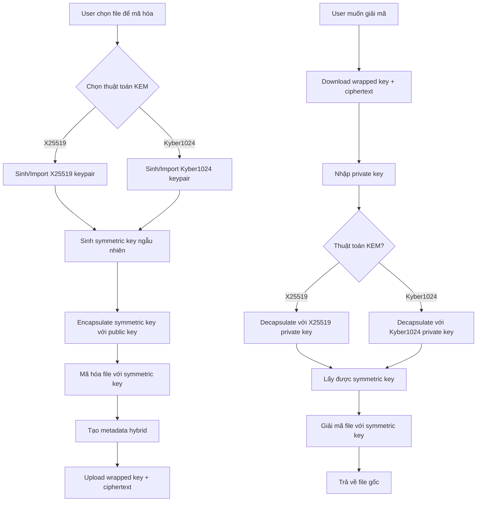

# Mã Hóa Lai - Hybrid Encryption Module

## Mục Đích và Phạm Vi

Module Hybrid Encryption triển khai cơ chế Key Encapsulation Mechanism (KEM) sử dụng X25519 (classical) và Kyber1024 (post-quantum). Kết hợp ưu điểm của mã hóa bất đối xứng (quản lý key) và mã hóa đối xứng (hiệu suất cao) theo nguyên tắc Zero Knowledge.

## Sơ Đồ Luồng Dữ Liệu



## Key Encapsulation Mechanisms

### 1. X25519 (Classical ECDH)
**Đặc điểm**:
- Key size: 32 bytes (private/public)
- Shared secret: 32 bytes
- Hiệu suất cao, widely supported
- Elliptic Curve Diffie-Hellman
- Không kháng lượng tử

```typescript
import { x25519 } from '@noble/curves/ed25519';

interface X25519KeyPair {
  privateKey: Uint8Array; // 32 bytes
  publicKey: Uint8Array;  // 32 bytes
}

async function generateX25519KeyPair(): Promise<X25519KeyPair> {
  const privateKey = x25519.utils.randomPrivateKey();
  const publicKey = x25519.getPublicKey(privateKey);
  
  return { privateKey, publicKey };
}

async function x25519Encapsulate(
  symmetricKey: Uint8Array,
  recipientPublicKey: Uint8Array
): Promise<{
  ciphertext: Uint8Array;
  sharedSecret: Uint8Array;
}> {
  // Sinh ephemeral keypair
  const ephemeralPrivateKey = x25519.utils.randomPrivateKey();
  const ephemeralPublicKey = x25519.getPublicKey(ephemeralPrivateKey);
  
  // Tính shared secret
  const sharedSecret = x25519.getSharedSecret(ephemeralPrivateKey, recipientPublicKey);
  
  // Derive encryption key từ shared secret
  const encryptionKey = await deriveKey(sharedSecret, 'X25519-KEM');
  
  // Encrypt symmetric key
  const iv = crypto.getRandomValues(new Uint8Array(12));
  const encrypted = await encryptAES256GCM(symmetricKey, encryptionKey, iv);
  
  // Ciphertext = ephemeral public key + IV + encrypted symmetric key
  const ciphertext = new Uint8Array(32 + 12 + encrypted.byteLength);
  ciphertext.set(ephemeralPublicKey, 0);
  ciphertext.set(iv, 32);
  ciphertext.set(new Uint8Array(encrypted), 44);
  
  return { ciphertext, sharedSecret };
}

async function x25519Decapsulate(
  ciphertext: Uint8Array,
  recipientPrivateKey: Uint8Array
): Promise<Uint8Array> {
  // Extract components
  const ephemeralPublicKey = ciphertext.slice(0, 32);
  const iv = ciphertext.slice(32, 44);
  const encryptedSymmetricKey = ciphertext.slice(44);
  
  // Tính shared secret
  const sharedSecret = x25519.getSharedSecret(recipientPrivateKey, ephemeralPublicKey);
  
  // Derive encryption key
  const encryptionKey = await deriveKey(sharedSecret, 'X25519-KEM');
  
  // Decrypt symmetric key
  const symmetricKey = await decryptAES256GCM(encryptedSymmetricKey, encryptionKey, iv);
  
  return new Uint8Array(symmetricKey);
}
```

### 2. Kyber1024 (Post-Quantum KEM)
**Đặc điểm**:
- Private key: ~2400 bytes
- Public key: ~1568 bytes
- Ciphertext: ~1568 bytes
- Shared secret: 32 bytes
- NIST standardized (ML-KEM)
- Lattice-based, quantum-resistant

```typescript
import { Kyber1024 } from 'pqcrypto-js';

interface Kyber1024KeyPair {
  privateKey: Uint8Array; // ~2400 bytes
  publicKey: Uint8Array;  // ~1568 bytes
}

async function generateKyber1024KeyPair(): Promise<Kyber1024KeyPair> {
  const keyPair = await Kyber1024.keyPair();
  return {
    privateKey: keyPair.privateKey,
    publicKey: keyPair.publicKey
  };
}

async function kyber1024Encapsulate(
  symmetricKey: Uint8Array,
  recipientPublicKey: Uint8Array
): Promise<{
  ciphertext: Uint8Array;
  sharedSecret: Uint8Array;
}> {
  // Kyber KEM encapsulation
  const { ciphertext: kemCiphertext, sharedSecret } = await Kyber1024.encapsulate(recipientPublicKey);
  
  // Derive encryption key từ shared secret
  const encryptionKey = await deriveKey(sharedSecret, 'Kyber1024-KEM');
  
  // Encrypt symmetric key
  const iv = crypto.getRandomValues(new Uint8Array(12));
  const encrypted = await encryptAES256GCM(symmetricKey, encryptionKey, iv);
  
  // Ciphertext = KEM ciphertext + IV + encrypted symmetric key
  const totalCiphertext = new Uint8Array(kemCiphertext.length + 12 + encrypted.byteLength);
  totalCiphertext.set(kemCiphertext, 0);
  totalCiphertext.set(iv, kemCiphertext.length);
  totalCiphertext.set(new Uint8Array(encrypted), kemCiphertext.length + 12);
  
  return { ciphertext: totalCiphertext, sharedSecret };
}

async function kyber1024Decapsulate(
  ciphertext: Uint8Array,
  recipientPrivateKey: Uint8Array
): Promise<Uint8Array> {
  // Extract KEM ciphertext (first 1568 bytes)
  const kemCiphertext = ciphertext.slice(0, 1568);
  const iv = ciphertext.slice(1568, 1580);
  const encryptedSymmetricKey = ciphertext.slice(1580);
  
  // Kyber KEM decapsulation
  const sharedSecret = await Kyber1024.decapsulate(kemCiphertext, recipientPrivateKey);
  
  // Derive encryption key
  const encryptionKey = await deriveKey(sharedSecret, 'Kyber1024-KEM');
  
  // Decrypt symmetric key
  const symmetricKey = await decryptAES256GCM(encryptedSymmetricKey, encryptionKey, iv);
  
  return new Uint8Array(symmetricKey);
}
```

## Key Derivation Function

### HKDF Implementation
```typescript
async function deriveKey(
  sharedSecret: Uint8Array,
  context: string,
  length: number = 32
): Promise<CryptoKey> {
  // Import shared secret as key material
  const keyMaterial = await crypto.subtle.importKey(
    'raw',
    sharedSecret,
    'HKDF',
    false,
    ['deriveKey']
  );
  
  // Derive AES key
  const derivedKey = await crypto.subtle.deriveKey(
    {
      name: 'HKDF',
      hash: 'SHA-256',
      salt: new TextEncoder().encode('ZKFS-Hybrid-Encryption'),
      info: new TextEncoder().encode(context)
    },
    keyMaterial,
    { name: 'AES-GCM', length: length * 8 },
    false,
    ['encrypt', 'decrypt']
  );
  
  return derivedKey;
}
```

## Hybrid Encryption Workflow

### 1. Encryption Process
```typescript
async function hybridEncrypt(
  file: File,
  recipientPublicKey: Uint8Array,
  algorithm: 'X25519' | 'Kyber1024'
): Promise<HybridEncryptionResult> {
  // 1. Sinh symmetric key ngẫu nhiên
  const symmetricKey = crypto.getRandomValues(new Uint8Array(32));
  
  // 2. Encapsulate symmetric key
  let encapsulationResult: { ciphertext: Uint8Array; sharedSecret: Uint8Array };
  
  switch (algorithm) {
    case 'X25519':
      encapsulationResult = await x25519Encapsulate(symmetricKey, recipientPublicKey);
      break;
    case 'Kyber1024':
      encapsulationResult = await kyber1024Encapsulate(symmetricKey, recipientPublicKey);
      break;
    default:
      throw new Error(`Unsupported algorithm: ${algorithm}`);
  }
  
  // 3. Mã hóa file với symmetric key
  const fileData = new Uint8Array(await file.arrayBuffer());
  const iv = crypto.getRandomValues(new Uint8Array(12));
  const encryptedFile = await encryptAES256GCM(fileData, symmetricKey, iv);
  
  // 4. Tạo metadata
  const metadata: HybridEncryptionMetadata = {
    algorithm,
    wrappedKey: Array.from(encapsulationResult.ciphertext),
    iv: Array.from(iv),
    originalName: file.name,
    originalSize: file.size,
    mimeType: file.type,
    checksum: await calculateSHA256(fileData),
    timestamp: new Date().toISOString(),
    version: '1.0'
  };
  
  // 5. Secure cleanup
  crypto.getRandomValues(symmetricKey); // Overwrite symmetric key
  
  return {
    encryptedData: new Uint8Array(encryptedFile),
    metadata,
    wrappedKey: encapsulationResult.ciphertext
  };
}
```

### 2. Decryption Process
```typescript
async function hybridDecrypt(
  encryptedData: Uint8Array,
  metadata: HybridEncryptionMetadata,
  recipientPrivateKey: Uint8Array
): Promise<Uint8Array> {
  // 1. Decapsulate symmetric key
  let symmetricKey: Uint8Array;
  
  switch (metadata.algorithm) {
    case 'X25519':
      symmetricKey = await x25519Decapsulate(
        new Uint8Array(metadata.wrappedKey),
        recipientPrivateKey
      );
      break;
    case 'Kyber1024':
      symmetricKey = await kyber1024Decapsulate(
        new Uint8Array(metadata.wrappedKey),
        recipientPrivateKey
      );
      break;
    default:
      throw new Error(`Unsupported algorithm: ${metadata.algorithm}`);
  }
  
  // 2. Giải mã file
  const decryptedData = await decryptAES256GCM(
    encryptedData,
    symmetricKey,
    new Uint8Array(metadata.iv)
  );
  
  // 3. Verify checksum
  const actualChecksum = await calculateSHA256(new Uint8Array(decryptedData));
  if (actualChecksum !== metadata.checksum) {
    throw new Error('Checksum verification failed');
  }
  
  // 4. Secure cleanup
  crypto.getRandomValues(symmetricKey);
  
  return new Uint8Array(decryptedData);
}
```

## Metadata Structure

### Hybrid Encryption Metadata
```typescript
interface HybridEncryptionMetadata {
  // Algorithm information
  algorithm: 'X25519' | 'Kyber1024';
  version: string;
  
  // Key encapsulation data
  wrappedKey: number[];        // Encapsulated symmetric key
  iv: number[];               // IV cho symmetric encryption
  
  // File information
  originalName: string;
  originalSize: number;
  mimeType: string;
  checksum: string;           // SHA256 của plaintext
  
  // Timestamps
  timestamp: string;          // ISO string
  
  // Optional recipient info
  recipientInfo?: {
    publicKeyFingerprint: string;
    algorithm: string;
  };
  
  // Compatibility
  compatibility: string[];
}
```

### Key Information
```typescript
interface KeyInfo {
  algorithm: 'X25519' | 'Kyber1024';
  publicKey: Uint8Array;
  privateKey?: Uint8Array;    // Chỉ lưu local, encrypted
  fingerprint: string;        // SHA256 của public key
  createdAt: string;
  label?: string;             // User-friendly name
}
```

## Key Management

### 1. Key Generation và Storage
```typescript
class HybridKeyManager {
  async generateKeyPair(algorithm: 'X25519' | 'Kyber1024'): Promise<{
    publicKey: string;
    privateKey: string;
    fingerprint: string;
  }> {
    let keyPair: any;
    
    switch (algorithm) {
      case 'X25519':
        keyPair = await generateX25519KeyPair();
        break;
      case 'Kyber1024':
        keyPair = await generateKyber1024KeyPair();
        break;
    }
    
    // Calculate fingerprint
    const fingerprint = await this.calculateFingerprint(keyPair.publicKey);
    
    return {
      publicKey: this.encodeKey(keyPair.publicKey),
      privateKey: this.encodeKey(keyPair.privateKey),
      fingerprint
    };
  }
  
  async storeKeyPair(
    algorithm: string,
    keyPair: { publicKey: string; privateKey: string },
    password: string,
    label?: string
  ): Promise<void> {
    // Encrypt private key với password
    const encryptedPrivateKey = await this.encryptPrivateKey(
      keyPair.privateKey,
      password
    );
    
    const keyInfo: KeyInfo = {
      algorithm: algorithm as 'X25519' | 'Kyber1024',
      publicKey: this.decodeKey(keyPair.publicKey),
      fingerprint: await this.calculateFingerprint(this.decodeKey(keyPair.publicKey)),
      createdAt: new Date().toISOString(),
      label
    };
    
    // Store in IndexedDB
    await this.saveToIndexedDB(keyInfo, encryptedPrivateKey);
  }
  
  private async calculateFingerprint(publicKey: Uint8Array): Promise<string> {
    const hash = await crypto.subtle.digest('SHA-256', publicKey);
    return Array.from(new Uint8Array(hash))
      .map(b => b.toString(16).padStart(2, '0'))
      .join('')
      .substring(0, 16); // First 16 chars
  }
  
  private encodeKey(key: Uint8Array): string {
    return btoa(String.fromCharCode(...key));
  }
  
  private decodeKey(encodedKey: string): Uint8Array {
    return new Uint8Array(
      atob(encodedKey).split('').map(char => char.charCodeAt(0))
    );
  }
}
```

### 2. Key Exchange và Sharing
```typescript
class KeyExchange {
  // Export public key để share
  async exportPublicKey(fingerprint: string): Promise<string> {
    const keyInfo = await this.loadKeyInfo(fingerprint);
    
    const exportData = {
      algorithm: keyInfo.algorithm,
      publicKey: this.encodeKey(keyInfo.publicKey),
      fingerprint: keyInfo.fingerprint,
      label: keyInfo.label,
      exportedAt: new Date().toISOString()
    };
    
    return btoa(JSON.stringify(exportData));
  }
  
  // Import public key từ người khác
  async importPublicKey(exportedKey: string): Promise<KeyInfo> {
    const exportData = JSON.parse(atob(exportedKey));
    
    // Validate imported key
    const publicKey = this.decodeKey(exportData.publicKey);
    const calculatedFingerprint = await this.calculateFingerprint(publicKey);
    
    if (calculatedFingerprint !== exportData.fingerprint) {
      throw new Error('Invalid key fingerprint');
    }
    
    const keyInfo: KeyInfo = {
      algorithm: exportData.algorithm,
      publicKey: publicKey,
      fingerprint: exportData.fingerprint,
      createdAt: exportData.exportedAt,
      label: exportData.label
    };
    
    // Store imported public key
    await this.savePublicKey(keyInfo);
    
    return keyInfo;
  }
}
```

## Performance Optimization

### 1. Algorithm Selection Strategy
```typescript
class AlgorithmSelector {
  selectOptimalAlgorithm(
    fileSize: number,
    securityLevel: 'standard' | 'high' | 'quantum-safe'
  ): 'X25519' | 'Kyber1024' {
    switch (securityLevel) {
      case 'quantum-safe':
        return 'Kyber1024';
      case 'high':
        return fileSize > 100 * 1024 * 1024 ? 'X25519' : 'Kyber1024'; // 100MB threshold
      case 'standard':
      default:
        return 'X25519';
    }
  }
  
  getPerformanceMetrics(algorithm: 'X25519' | 'Kyber1024') {
    return {
      'X25519': {
        keyGenTime: '~1ms',
        encapsulationTime: '~2ms',
        decapsulationTime: '~2ms',
        keySize: '32 bytes',
        ciphertextOverhead: '44 bytes'
      },
      'Kyber1024': {
        keyGenTime: '~10ms',
        encapsulationTime: '~5ms',
        decapsulationTime: '~8ms',
        keySize: '1568 bytes',
        ciphertextOverhead: '1580 bytes'
      }
    }[algorithm];
  }
}
```

### 2. Batch Processing
```typescript
async function hybridEncryptMultipleFiles(
  files: File[],
  recipientPublicKey: Uint8Array,
  algorithm: 'X25519' | 'Kyber1024'
): Promise<HybridEncryptionResult[]> {
  // Sinh một symmetric key cho tất cả files (optional optimization)
  const masterSymmetricKey = crypto.getRandomValues(new Uint8Array(32));
  
  // Encapsulate master key một lần
  const encapsulationResult = algorithm === 'X25519'
    ? await x25519Encapsulate(masterSymmetricKey, recipientPublicKey)
    : await kyber1024Encapsulate(masterSymmetricKey, recipientPublicKey);
  
  // Encrypt từng file với derived keys
  const results: HybridEncryptionResult[] = [];
  
  for (let i = 0; i < files.length; i++) {
    const file = files[i];
    
    // Derive unique key cho mỗi file
    const fileKey = await deriveKey(
      masterSymmetricKey,
      `file-${i}-${file.name}`,
      32
    );
    
    // Encrypt file
    const iv = crypto.getRandomValues(new Uint8Array(12));
    const fileData = new Uint8Array(await file.arrayBuffer());
    const encryptedFile = await encryptAES256GCM(fileData, fileKey, iv);
    
    results.push({
      encryptedData: new Uint8Array(encryptedFile),
      metadata: {
        algorithm,
        wrappedKey: Array.from(encapsulationResult.ciphertext),
        iv: Array.from(iv),
        originalName: file.name,
        originalSize: file.size,
        mimeType: file.type,
        checksum: await calculateSHA256(fileData),
        timestamp: new Date().toISOString(),
        version: '1.0',
        fileIndex: i // For batch processing
      },
      wrappedKey: encapsulationResult.ciphertext
    });
  }
  
  // Secure cleanup
  crypto.getRandomValues(masterSymmetricKey);
  
  return results;
}
```

## Tích Hợp Với Các Module Khác

### Với Digital Signature Module
```typescript
async function hybridEncryptAndSign(
  file: File,
  recipientPublicKey: Uint8Array,
  signerPrivateKey: Uint8Array,
  algorithm: 'X25519' | 'Kyber1024'
): Promise<{
  encryptionResult: HybridEncryptionResult;
  signature: DigitalSignature;
}> {
  // 1. Hybrid encrypt file
  const encryptionResult = await hybridEncrypt(file, recipientPublicKey, algorithm);
  
  // 2. Sign encrypted data
  const signature = await signData(
    encryptionResult.encryptedData,
    'Ed25519', // hoặc Dilithium
    signerPrivateKey
  );
  
  return { encryptionResult, signature };
}
```

### Với Storage Module
```typescript
async function storeHybridEncryptedFile(
  encryptionResult: HybridEncryptionResult,
  userId: string
): Promise<string> {
  // Upload encrypted data lên MinIO
  const fileId = await uploadToMinIO(encryptionResult.encryptedData);
  
  // Store metadata trong MongoDB
  await storeMetadata({
    fileId,
    userId,
    type: 'hybrid-encrypted',
    metadata: encryptionResult.metadata,
    wrappedKeySize: encryptionResult.wrappedKey.length,
    createdAt: new Date()
  });
  
  return fileId;
}
```

## Tuân Thủ Zero Knowledge

### ✅ Nguyên Tắc Được Đảm Bảo
- Private key không bao giờ rời khỏi client
- Symmetric key sinh ngẫu nhiên cho mỗi file
- Server chỉ lưu wrapped key và ciphertext
- Decryption hoàn toàn tại client

### ⚠️ Lưu Ý Bảo Mật
```typescript
// Secure memory management
function secureCleanupHybridData(
  symmetricKey: Uint8Array,
  sharedSecret: Uint8Array,
  privateKey: Uint8Array
) {
  // Overwrite sensitive data
  crypto.getRandomValues(symmetricKey);
  crypto.getRandomValues(sharedSecret);
  crypto.getRandomValues(privateKey);
  
  // Clear references
  symmetricKey = null;
  sharedSecret = null;
  privateKey = null;
}
```

## Ví Dụ Triển Khai

### Hybrid Encryption Đơn Giản
```typescript
import { hybridEncrypt, hybridDecrypt } from './hybrid-encryption-service';

async function handleHybridEncryption(
  file: File, 
  recipientPublicKey: string,
  algorithm: 'X25519' | 'Kyber1024'
) {
  try {
    const publicKeyBytes = decodeKey(recipientPublicKey);
    const result = await hybridEncrypt(file, publicKeyBytes, algorithm);
    
    console.log('Hybrid encryption thành công');
    return result;
  } catch (error) {
    console.error('Lỗi hybrid encryption:', error);
    throw error;
  }
}

async function handleHybridDecryption(
  encryptedData: Uint8Array,
  metadata: HybridEncryptionMetadata,
  privateKey: string
) {
  try {
    const privateKeyBytes = decodeKey(privateKey);
    const decrypted = await hybridDecrypt(encryptedData, metadata, privateKeyBytes);
    
    console.log('Hybrid decryption thành công');
    return decrypted;
  } catch (error) {
    console.error('Lỗi hybrid decryption:', error);
    throw error;
  }
}
```
